import { Code } from '@astrojs/starlight/components';
import { Tabs, TabItem } from '@astrojs/starlight/components';
import { Badge } from '@astrojs/starlight/components';
import { Aside } from '@astrojs/starlight/components';
import { Steps } from '@astrojs/starlight/components';

# Módulo 5: CRUD con Base de Datos

En este módulo aprenderemos a conectar nuestras aplicaciones Swing con bases de datos reales, implementando operaciones CRUD (Create, Read, Update, Delete) usando JDBC.

## Conexión a MySQL/Oracle con JDBC

JDBC (Java Database Connectivity) es la API estándar de Java para conectarse a bases de datos relacionales.

### Configuración inicial

<Steps>
<ol>
  <li>**Agregar el driver JDBC** al proyecto (MySQL Connector/J para MySQL)</li>
  <li>**Configurar la base de datos** con las tablas necesarias</li>
  <li>**Crear la clase de conexión** para gestionar la conectividad</li>
</ol>
</Steps>

<Code code={`-- Script SQL para crear la base de datos de ejemplo
CREATE DATABASE swing_app;
USE swing_app;

CREATE TABLE usuarios (
    id INT AUTO_INCREMENT PRIMARY KEY,
    nombre VARCHAR(100) NOT NULL,
    email VARCHAR(150) UNIQUE NOT NULL,
    telefono VARCHAR(20),
    activo BOOLEAN DEFAULT TRUE,
    fecha_registro TIMESTAMP DEFAULT CURRENT_TIMESTAMP
);

CREATE TABLE categorias (
    id INT AUTO_INCREMENT PRIMARY KEY,
    nombre VARCHAR(50) NOT NULL,
    descripcion TEXT,
    activo BOOLEAN DEFAULT TRUE
);

INSERT INTO usuarios (nombre, email, telefono) VALUES
('Juan Pérez', 'juan@email.com', '555-0001'),
('María García', 'maria@email.com', '555-0002'),
('Carlos López', 'carlos@email.com', '555-0003');

INSERT INTO categorias (nombre, descripcion) VALUES
('Electrónicos', 'Dispositivos electrónicos y gadgets'),
('Ropa', 'Vestimenta y accesorios'),
('Hogar', 'Artículos para el hogar');`} lang="sql" title="database_setup.sql" />

### Clase de conexión

<Code code={`import java.sql.*;

public class ConexionDB {
    private static final String URL = "jdbc:mysql://localhost:3306/swing_app";
    private static final String USUARIO = "root";
    private static final String PASSWORD = "password";
    private static ConexionDB instancia;
    private Connection conexion;
    
    private ConexionDB() {
        try {
            Class.forName("com.mysql.cj.jdbc.Driver");
            this.conexion = DriverManager.getConnection(URL, USUARIO, PASSWORD);
            System.out.println("Conexión exitosa a la base de datos");
        } catch (ClassNotFoundException e) {
            System.err.println("Driver no encontrado: " + e.getMessage());
        } catch (SQLException e) {
            System.err.println("Error de conexión: " + e.getMessage());
        }
    }
    
    public static ConexionDB getInstance() {
        if (instancia == null) {
            instancia = new ConexionDB();
        }
        return instancia;
    }
    
    public Connection getConexion() {
        try {
            if (conexion == null || conexion.isClosed()) {
                instancia = new ConexionDB();
            }
        } catch (SQLException e) {
            System.err.println("Error verificando conexión: " + e.getMessage());
        }
        return conexion;
    }
    
    public void cerrarConexion() {
        try {
            if (conexion != null && !conexion.isClosed()) {
                conexion.close();
                System.out.println("Conexión cerrada");
            }
        } catch (SQLException e) {
            System.err.println("Error cerrando conexión: " + e.getMessage());
        }
    }
}`} lang="java" title="ConexionDB.java" />

<Aside type="caution">
En aplicaciones reales, nunca hardcodees las credenciales de la base de datos. Usa archivos de configuración o variables de entorno.
</Aside>

## Arquitectura en 3 Capas

Implementaremos una arquitectura en capas que separa claramente las responsabilidades:

### Estructura de la Arquitectura

```mermaid
graph TB
    A[Capa de Presentación<br/>UI - Swing] --> B[Capa de Lógica de Negocio<br/>Services]
    B --> C[Capa de Acceso a Datos<br/>DAO + Modelos]
    C --> D[(Base de Datos)]
    
    subgraph "Responsabilidades"
        E["🖥️ Presentación:<br/>- Interfaz de usuario<br/>- Validaciones de UI<br/>- Eventos y listeners"]
        F["⚙️ Lógica de Negocio:<br/>- Reglas de negocio<br/>- Validaciones complejas<br/>- Coordinación de operaciones"]
        G["💾 Acceso a Datos:<br/>- Operaciones CRUD<br/>- Mapeo objeto-relacional<br/>- Gestión de conexiones"]
    end
```



<Aside type="tip">
**Beneficios de la Arquitectura en Capas:**
- **Separación de responsabilidades**: Cada capa tiene un propósito específico
- **Mantenibilidad**: Cambios en una capa no afectan las otras
- **Testabilidad**: Cada capa se puede probar independientemente
- **Reutilización**: La lógica de negocio puede ser usada por diferentes interfaces
</Aside>

## Capa de Acceso a Datos (DAO Pattern)

El patrón DAO (Data Access Object) encapsula el acceso a la fuente de datos.

### 1. Modelo de Datos (Entidades)

<Code code={`public class Usuario {
    private int id;
    private String nombre;
    private String email;
    private String telefono;
    private boolean activo;
    private java.sql.Timestamp fechaRegistro;
    
    // Constructor vacío
    public Usuario() {}
    
    // Constructor con parámetros
    public Usuario(String nombre, String email, String telefono, boolean activo) {
        this.nombre = nombre;
        this.email = email;
        this.telefono = telefono;
        this.activo = activo;
    }
    
    // Getters y Setters
    public int getId() { return id; }
    public void setId(int id) { this.id = id; }
    
    public String getNombre() { return nombre; }
    public void setNombre(String nombre) { this.nombre = nombre; }
    
    public String getEmail() { return email; }
    public void setEmail(String email) { this.email = email; }
    
    public String getTelefono() { return telefono; }
    public void setTelefono(String telefono) { this.telefono = telefono; }
    
    public boolean isActivo() { return activo; }
    public void setActivo(boolean activo) { this.activo = activo; }
    
    public java.sql.Timestamp getFechaRegistro() { return fechaRegistro; }
    public void setFechaRegistro(java.sql.Timestamp fechaRegistro) { 
        this.fechaRegistro = fechaRegistro; 
    }
    
    @Override
    public String toString() {
        return "Usuario{" +
                "id=" + id +
                ", nombre='" + nombre + '\'' +
                ", email='" + email + '\'' +
                ", telefono='" + telefono + '\'' +
                ", activo=" + activo +
                '}';
    }
}`} lang="java" title="Usuario.java" />

### 2. Interfaz DAO

Primero definimos el contrato que debe cumplir nuestro DAO:

<Code code={`import java.util.List;
import java.util.Optional;

public interface IUsuarioDAO {
    // Operaciones CRUD básicas
    boolean insertar(Usuario usuario);
    Optional<Usuario> obtenerPorId(int id);
    List<Usuario> obtenerTodos();
    boolean actualizar(Usuario usuario);
    boolean eliminar(int id);
    
    // Operaciones de búsqueda
    List<Usuario> buscarPorNombre(String nombre);
    List<Usuario> buscarPorEmail(String email);
    List<Usuario> obtenerActivos();
    
    // Operaciones de validación
    boolean existeEmail(String email);
    int contarUsuarios();
}`} lang="java" title="IUsuarioDAO.java" />

### 3. Implementación DAO

<Code code={`import java.sql.*;
import java.util.ArrayList;
import java.util.List;

public class UsuarioDAO implements IUsuarioDAO {
    private Connection conexion;
    
    public UsuarioDAO() {
        this.conexion = ConexionDB.getInstance().getConexion();
    }
    
    // CREATE - Insertar usuario
    public boolean insertar(Usuario usuario) {
        String sql = "INSERT INTO usuarios (nombre, email, telefono, activo) VALUES (?, ?, ?, ?)";
        
        try (PreparedStatement stmt = conexion.prepareStatement(sql)) {
            stmt.setString(1, usuario.getNombre());
            stmt.setString(2, usuario.getEmail());
            stmt.setString(3, usuario.getTelefono());
            stmt.setBoolean(4, usuario.isActivo());
            
            int filasAfectadas = stmt.executeUpdate();
            return filasAfectadas > 0;
            
        } catch (SQLException e) {
            System.err.println("Error insertando usuario: " + e.getMessage());
            return false;
        }
    }
    
    // READ - Obtener todos los usuarios
    public List<Usuario> obtenerTodos() {
        List<Usuario> usuarios = new ArrayList<>();
        String sql = "SELECT * FROM usuarios ORDER BY id";
        
        try (Statement stmt = conexion.createStatement();
             ResultSet rs = stmt.executeQuery(sql)) {
            
            while (rs.next()) {
                Usuario usuario = new Usuario();
                usuario.setId(rs.getInt("id"));
                usuario.setNombre(rs.getString("nombre"));
                usuario.setEmail(rs.getString("email"));
                usuario.setTelefono(rs.getString("telefono"));
                usuario.setActivo(rs.getBoolean("activo"));
                usuario.setFechaRegistro(rs.getTimestamp("fecha_registro"));
                
                usuarios.add(usuario);
            }
            
        } catch (SQLException e) {
            System.err.println("Error obteniendo usuarios: " + e.getMessage());
        }
        
        return usuarios;
    }
    
    // READ - Obtener usuario por ID
    public Usuario obtenerPorId(int id) {
        String sql = "SELECT * FROM usuarios WHERE id = ?";
        
        try (PreparedStatement stmt = conexion.prepareStatement(sql)) {
            stmt.setInt(1, id);
            
            try (ResultSet rs = stmt.executeQuery()) {
                if (rs.next()) {
                    Usuario usuario = new Usuario();
                    usuario.setId(rs.getInt("id"));
                    usuario.setNombre(rs.getString("nombre"));
                    usuario.setEmail(rs.getString("email"));
                    usuario.setTelefono(rs.getString("telefono"));
                    usuario.setActivo(rs.getBoolean("activo"));
                    usuario.setFechaRegistro(rs.getTimestamp("fecha_registro"));
                    
                    return usuario;
                }
            }
            
        } catch (SQLException e) {
            System.err.println("Error obteniendo usuario por ID: " + e.getMessage());
        }
        
        return null;
    }
    
    // UPDATE - Actualizar usuario
    public boolean actualizar(Usuario usuario) {
        String sql = "UPDATE usuarios SET nombre = ?, email = ?, telefono = ?, activo = ? WHERE id = ?";
        
        try (PreparedStatement stmt = conexion.prepareStatement(sql)) {
            stmt.setString(1, usuario.getNombre());
            stmt.setString(2, usuario.getEmail());
            stmt.setString(3, usuario.getTelefono());
            stmt.setBoolean(4, usuario.isActivo());
            stmt.setInt(5, usuario.getId());
            
            int filasAfectadas = stmt.executeUpdate();
            return filasAfectadas > 0;
            
        } catch (SQLException e) {
            System.err.println("Error actualizando usuario: " + e.getMessage());
            return false;
        }
    }
    
    // DELETE - Eliminar usuario
    public boolean eliminar(int id) {
        String sql = "DELETE FROM usuarios WHERE id = ?";
        
        try (PreparedStatement stmt = conexion.prepareStatement(sql)) {
            stmt.setInt(1, id);
            
            int filasAfectadas = stmt.executeUpdate();
            return filasAfectadas > 0;
            
        } catch (SQLException e) {
            System.err.println("Error eliminando usuario: " + e.getMessage());
            return false;
        }
    }
    
    // Buscar usuarios por nombre
    public List<Usuario> buscarPorNombre(String nombre) {
        List<Usuario> usuarios = new ArrayList<>();
        String sql = "SELECT * FROM usuarios WHERE nombre LIKE ? ORDER BY nombre";
        
        try (PreparedStatement stmt = conexion.prepareStatement(sql)) {
            stmt.setString(1, "%" + nombre + "%");
            
            try (ResultSet rs = stmt.executeQuery()) {
                while (rs.next()) {
                    Usuario usuario = new Usuario();
                    usuario.setId(rs.getInt("id"));
                    usuario.setNombre(rs.getString("nombre"));
                    usuario.setEmail(rs.getString("email"));
                    usuario.setTelefono(rs.getString("telefono"));
                    usuario.setActivo(rs.getBoolean("activo"));
                    usuario.setFechaRegistro(rs.getTimestamp("fecha_registro"));
                    
                    usuarios.add(usuario);
                }
            }
            
        } catch (SQLException e) {
            System.err.println("Error buscando usuarios: " + e.getMessage());
        }
        
        return usuarios;
    }
    
    @Override
    public Optional<Usuario> obtenerPorId(int id) {
        String sql = "SELECT * FROM usuarios WHERE id = ?";
        
        try (PreparedStatement stmt = conexion.prepareStatement(sql)) {
            stmt.setInt(1, id);
            
            try (ResultSet rs = stmt.executeQuery()) {
                if (rs.next()) {
                    return Optional.of(mapearUsuario(rs));
                }
            }
        } catch (SQLException e) {
            System.err.println("Error obteniendo usuario por ID: " + e.getMessage());
        }
        
        return Optional.empty();
    }
    
    @Override
    public List<Usuario> buscarPorEmail(String email) {
        List<Usuario> usuarios = new ArrayList<>();
        String sql = "SELECT * FROM usuarios WHERE email LIKE ? ORDER BY email";
        
        try (PreparedStatement stmt = conexion.prepareStatement(sql)) {
            stmt.setString(1, "%" + email + "%");
            
            try (ResultSet rs = stmt.executeQuery()) {
                while (rs.next()) {
                    usuarios.add(mapearUsuario(rs));
                }
            }
        } catch (SQLException e) {
            System.err.println("Error buscando usuarios por email: " + e.getMessage());
        }
        
        return usuarios;
    }
    
    @Override
    public List<Usuario> obtenerActivos() {
        List<Usuario> usuarios = new ArrayList<>();
        String sql = "SELECT * FROM usuarios WHERE activo = true ORDER BY nombre";
        
        try (Statement stmt = conexion.createStatement();
             ResultSet rs = stmt.executeQuery(sql)) {
            
            while (rs.next()) {
                usuarios.add(mapearUsuario(rs));
            }
        } catch (SQLException e) {
            System.err.println("Error obteniendo usuarios activos: " + e.getMessage());
        }
        
        return usuarios;
    }
    
    @Override
    public boolean existeEmail(String email) {
        String sql = "SELECT COUNT(*) FROM usuarios WHERE email = ?";
        
        try (PreparedStatement stmt = conexion.prepareStatement(sql)) {
            stmt.setString(1, email);
            
            try (ResultSet rs = stmt.executeQuery()) {
                if (rs.next()) {
                    return rs.getInt(1) > 0;
                }
            }
        } catch (SQLException e) {
            System.err.println("Error verificando email: " + e.getMessage());
        }
        
        return false;
    }
    
    @Override
    public int contarUsuarios() {
        String sql = "SELECT COUNT(*) FROM usuarios";
        
        try (Statement stmt = conexion.createStatement();
             ResultSet rs = stmt.executeQuery(sql)) {
            
            if (rs.next()) {
                return rs.getInt(1);
            }
        } catch (SQLException e) {
            System.err.println("Error contando usuarios: " + e.getMessage());
        }
        
        return 0;
    }
    
    // Método auxiliar para mapear ResultSet a Usuario
    private Usuario mapearUsuario(ResultSet rs) throws SQLException {
        Usuario usuario = new Usuario();
        usuario.setId(rs.getInt("id"));
        usuario.setNombre(rs.getString("nombre"));
        usuario.setEmail(rs.getString("email"));
        usuario.setTelefono(rs.getString("telefono"));
        usuario.setActivo(rs.getBoolean("activo"));
        usuario.setFechaRegistro(rs.getTimestamp("fecha_registro"));
        return usuario;
    }
}`} lang="java" title="UsuarioDAO.java" />

## Capa de Lógica de Negocio (Service Layer)

La capa de servicios contiene la lógica de negocio y coordina las operaciones entre la UI y el DAO.

### 1. Interfaz del Servicio

<Code code={`import java.util.List;

public interface IUsuarioService {
    // Operaciones de negocio
    ResultadoOperacion<Usuario> crearUsuario(Usuario usuario);
    ResultadoOperacion<Usuario> actualizarUsuario(Usuario usuario);
    ResultadoOperacion<Boolean> eliminarUsuario(int id);
    
    // Consultas
    List<Usuario> obtenerTodosLosUsuarios();
    Usuario obtenerUsuarioPorId(int id);
    List<Usuario> buscarUsuarios(String criterio);
    List<Usuario> obtenerUsuariosActivos();
    
    // Validaciones y estadísticas
    boolean validarDatosUsuario(Usuario usuario);
    int obtenerTotalUsuarios();
    boolean existeEmailEnUso(String email, int idUsuarioExcluir);
}

// Clase para encapsular resultados de operaciones
class ResultadoOperacion<T> {
    private boolean exitoso;
    private String mensaje;
    private T dato;
    private List<String> errores;
    
    public ResultadoOperacion(boolean exitoso, String mensaje, T dato) {
        this.exitoso = exitoso;
        this.mensaje = mensaje;
        this.dato = dato;
        this.errores = new ArrayList<>();
    }
    
    public ResultadoOperacion(boolean exitoso, String mensaje) {
        this(exitoso, mensaje, null);
    }
    
    // Getters y setters
    public boolean isExitoso() { return exitoso; }
    public String getMensaje() { return mensaje; }
    public T getDato() { return dato; }
    public List<String> getErrores() { return errores; }
    public void agregarError(String error) { this.errores.add(error); }
}`} lang="java" title="IUsuarioService.java" />

### 2. Implementación del Servicio

<Code code={`import java.util.List;
import java.util.ArrayList;
import java.util.regex.Pattern;

public class UsuarioService implements IUsuarioService {
    private IUsuarioDAO usuarioDAO;
    private static final Pattern EMAIL_PATTERN = 
        Pattern.compile("^[A-Za-z0-9+_.-]+@[A-Za-z0-9.-]+\\.[A-Za-z]{2,}$");
    
    public UsuarioService(IUsuarioDAO usuarioDAO) {
        this.usuarioDAO = usuarioDAO;
    }
    
    @Override
    public ResultadoOperacion<Usuario> crearUsuario(Usuario usuario) {
        // Validaciones de negocio
        List<String> errores = validarUsuarioCompleto(usuario, true);
        if (!errores.isEmpty()) {
            ResultadoOperacion<Usuario> resultado = new ResultadoOperacion<>(
                false, "Error de validación", null);
            errores.forEach(resultado::agregarError);
            return resultado;
        }
        
        // Verificar email único
        if (usuarioDAO.existeEmail(usuario.getEmail())) {
            return new ResultadoOperacion<>(false, 
                "Ya existe un usuario con ese email", null);
        }
        
        // Aplicar reglas de negocio
        usuario.setNombre(normalizarNombre(usuario.getNombre()));
        usuario.setEmail(usuario.getEmail().toLowerCase().trim());
        
        // Intentar insertar
        boolean insertado = usuarioDAO.insertar(usuario);
        if (insertado) {
            return new ResultadoOperacion<>(true, 
                "Usuario creado exitosamente", usuario);
        } else {
            return new ResultadoOperacion<>(false, 
                "Error al crear el usuario en la base de datos", null);
        }
    }
    
    @Override
    public ResultadoOperacion<Usuario> actualizarUsuario(Usuario usuario) {
        // Verificar que el usuario existe
        if (usuarioDAO.obtenerPorId(usuario.getId()).isEmpty()) {
            return new ResultadoOperacion<>(false, 
                "El usuario no existe", null);
        }
        
        // Validaciones de negocio
        List<String> errores = validarUsuarioCompleto(usuario, false);
        if (!errores.isEmpty()) {
            ResultadoOperacion<Usuario> resultado = new ResultadoOperacion<>(
                false, "Error de validación", null);
            errores.forEach(resultado::agregarError);
            return resultado;
        }
        
        // Verificar email único (excluyendo el usuario actual)
        if (existeEmailEnUso(usuario.getEmail(), usuario.getId())) {
            return new ResultadoOperacion<>(false, 
                "Ya existe otro usuario con ese email", null);
        }
        
        // Aplicar reglas de negocio
        usuario.setNombre(normalizarNombre(usuario.getNombre()));
        usuario.setEmail(usuario.getEmail().toLowerCase().trim());
        
        // Intentar actualizar
        boolean actualizado = usuarioDAO.actualizar(usuario);
        if (actualizado) {
            return new ResultadoOperacion<>(true, 
                "Usuario actualizado exitosamente", usuario);
        } else {
            return new ResultadoOperacion<>(false, 
                "Error al actualizar el usuario", null);
        }
    }
    
    @Override
    public ResultadoOperacion<Boolean> eliminarUsuario(int id) {
        // Verificar que el usuario existe
        if (usuarioDAO.obtenerPorId(id).isEmpty()) {
            return new ResultadoOperacion<>(false, 
                "El usuario no existe", false);
        }
        
        // Reglas de negocio para eliminación
        // Por ejemplo: no permitir eliminar si es el último administrador
        
        boolean eliminado = usuarioDAO.eliminar(id);
        if (eliminado) {
            return new ResultadoOperacion<>(true, 
                "Usuario eliminado exitosamente", true);
        } else {
            return new ResultadoOperacion<>(false, 
                "Error al eliminar el usuario", false);
        }
    }
    
    @Override
    public List<Usuario> obtenerTodosLosUsuarios() {
        return usuarioDAO.obtenerTodos();
    }
    
    @Override
    public Usuario obtenerUsuarioPorId(int id) {
        return usuarioDAO.obtenerPorId(id).orElse(null);
    }
    
    @Override
    public List<Usuario> buscarUsuarios(String criterio) {
        if (criterio == null || criterio.trim().isEmpty()) {
            return obtenerTodosLosUsuarios();
        }
        
        String criterioBusqueda = criterio.trim();
        
        // Buscar por nombre y email
        List<Usuario> resultados = new ArrayList<>();
        resultados.addAll(usuarioDAO.buscarPorNombre(criterioBusqueda));
        resultados.addAll(usuarioDAO.buscarPorEmail(criterioBusqueda));
        
        // Eliminar duplicados manteniendo el orden
        return resultados.stream()
            .distinct()
            .collect(Collectors.toList());
    }
    
    @Override
    public List<Usuario> obtenerUsuariosActivos() {
        return usuarioDAO.obtenerActivos();
    }
    
    @Override
    public boolean validarDatosUsuario(Usuario usuario) {
        return validarUsuarioCompleto(usuario, true).isEmpty();
    }
    
    @Override
    public int obtenerTotalUsuarios() {
        return usuarioDAO.contarUsuarios();
    }
    
    @Override
    public boolean existeEmailEnUso(String email, int idUsuarioExcluir) {
        // Obtener todos los usuarios con ese email
        List<Usuario> usuariosConEmail = usuarioDAO.buscarPorEmail(email);
        
        // Verificar si alguno tiene un ID diferente al excluido
        return usuariosConEmail.stream()
            .anyMatch(u -> u.getId() != idUsuarioExcluir && 
                          u.getEmail().equalsIgnoreCase(email.trim()));
    }
    
    // Métodos privados para validaciones y reglas de negocio
    private List<String> validarUsuarioCompleto(Usuario usuario, boolean esNuevo) {
        List<String> errores = new ArrayList<>();
        
        // Validar nombre
        if (usuario.getNombre() == null || usuario.getNombre().trim().isEmpty()) {
            errores.add("El nombre es obligatorio");
        } else if (usuario.getNombre().trim().length() < 2) {
            errores.add("El nombre debe tener al menos 2 caracteres");
        } else if (usuario.getNombre().trim().length() > 100) {
            errores.add("El nombre no puede exceder 100 caracteres");
        }
        
        // Validar email
        if (usuario.getEmail() == null || usuario.getEmail().trim().isEmpty()) {
            errores.add("El email es obligatorio");
        } else if (!EMAIL_PATTERN.matcher(usuario.getEmail().trim()).matches()) {
            errores.add("El formato del email es inválido");
        } else if (usuario.getEmail().trim().length() > 150) {
            errores.add("El email no puede exceder 150 caracteres");
        }
        
        // Validar teléfono (opcional)
        if (usuario.getTelefono() != null && !usuario.getTelefono().trim().isEmpty()) {
            String telefono = usuario.getTelefono().trim();
            if (telefono.length() < 7 || telefono.length() > 20) {
                errores.add("El teléfono debe tener entre 7 y 20 caracteres");
            }
            if (!telefono.matches("^[0-9+\\-()\\s]+$")) {
                errores.add("El teléfono contiene caracteres inválidos");
            }
        }
        
        return errores;
    }
    
    private String normalizarNombre(String nombre) {
        if (nombre == null) return null;
        
        // Eliminar espacios extra y capitalizar primera letra de cada palabra
        return Arrays.stream(nombre.trim().split("\\s+"))
            .map(palabra -> palabra.substring(0, 1).toUpperCase() + 
                           palabra.substring(1).toLowerCase())
            .collect(Collectors.joining(" "));
    }
}`} lang="java" title="UsuarioService.java" />

## Capa de Presentación Refactorizada

Ahora la interfaz de usuario se comunica únicamente con la capa de servicios:

### Vista Principal con Arquitectura en Capas

<Code code={`import javax.swing.*;
import javax.swing.table.DefaultTableModel;
import java.awt.*;
import java.awt.event.*;
import java.util.List;

public class GestorUsuarios extends JFrame {
    // Componentes de la UI
    private DefaultTableModel modeloTabla;
    private JTable tabla;
    private JTextField txtNombre, txtEmail, txtTelefono, txtBuscar;
    private JCheckBox chkActivo;
    private JButton btnAgregar, btnActualizar, btnEliminar, btnLimpiar, btnBuscar;
    private JLabel lblEstadisticas;
    
    // Capa de servicios - ÚNICA dependencia de la UI
    private IUsuarioService usuarioService;
    private Usuario usuarioSeleccionado;
    
    // Constructor con inyección de dependencias
    public GestorUsuarios(IUsuarioService usuarioService) {
        this.usuarioService = usuarioService;
        initComponents();
        cargarDatos();
        actualizarEstadisticas();
        setVisible(true);
    }
    
    // Constructor por defecto para compatibilidad
    public GestorUsuarios() {
        this(new UsuarioService(new UsuarioDAO()));
    }
    
    private void initComponents() {
        setTitle("Gestor de Usuarios - CRUD con Base de Datos");
        setSize(900, 600);
        setDefaultCloseOperation(JFrame.EXIT_ON_CLOSE);
        setLayout(new BorderLayout());
        
        // Panel principal dividido
        JSplitPane splitPane = new JSplitPane(JSplitPane.HORIZONTAL_SPLIT);
        splitPane.setLeftComponent(crearPanelTabla());
        splitPane.setRightComponent(crearPanelFormulario());
        splitPane.setDividerLocation(550);
        
        add(splitPane, BorderLayout.CENTER);
        add(crearPanelBusqueda(), BorderLayout.NORTH);
        add(crearPanelEstadisticas(), BorderLayout.SOUTH);
    }
    
    private JPanel crearPanelBusqueda() {
        JPanel panel = new JPanel(new FlowLayout(FlowLayout.LEFT));
        panel.setBorder(BorderFactory.createTitledBorder("Búsqueda"));
        
        panel.add(new JLabel("Buscar por nombre:"));
        txtBuscar = new JTextField(20);
        btnBuscar = new JButton("Buscar");
        JButton btnMostrarTodos = new JButton("Mostrar Todos");
        
        btnBuscar.addActionListener(e -> buscarUsuarios());
        btnMostrarTodos.addActionListener(e -> cargarDatos());
        
        // Buscar al presionar Enter
        txtBuscar.addActionListener(e -> buscarUsuarios());
        
        panel.add(txtBuscar);
        panel.add(btnBuscar);
        panel.add(btnMostrarTodos);
        
        return panel;
    }
    
    private JPanel crearPanelTabla() {
        JPanel panel = new JPanel(new BorderLayout());
        panel.setBorder(BorderFactory.createTitledBorder("Lista de Usuarios"));
        
        // Crear modelo de tabla
        String[] columnas = {"ID", "Nombre", "Email", "Teléfono", "Activo", "Fecha Registro"};
        modeloTabla = new DefaultTableModel(columnas, 0) {
            @Override
            public boolean isCellEditable(int row, int column) {
                return false; // Tabla no editable
            }
            
            @Override
            public Class<?> getColumnClass(int column) {
                if (column == 4) return Boolean.class;
                return String.class;
            }
        };
        
        tabla = new JTable(modeloTabla);
        tabla.setSelectionMode(ListSelectionModel.SINGLE_SELECTION);
        
        // Listener para selección
        tabla.getSelectionModel().addListSelectionListener(e -> {
            if (!e.getValueIsAdjusting()) {
                cargarUsuarioSeleccionado();
            }
        });
        
        // Configurar columnas
        tabla.getColumnModel().getColumn(0).setPreferredWidth(50);
        tabla.getColumnModel().getColumn(1).setPreferredWidth(150);
        tabla.getColumnModel().getColumn(2).setPreferredWidth(200);
        tabla.getColumnModel().getColumn(3).setPreferredWidth(120);
        tabla.getColumnModel().getColumn(4).setPreferredWidth(80);
        tabla.getColumnModel().getColumn(5).setPreferredWidth(150);
        
        panel.add(new JScrollPane(tabla), BorderLayout.CENTER);
        
        return panel;
    }
    
    private JPanel crearPanelFormulario() {
        JPanel panel = new JPanel(new GridBagLayout());
        panel.setBorder(BorderFactory.createTitledBorder("Datos del Usuario"));
        GridBagConstraints gbc = new GridBagConstraints();
        gbc.insets = new Insets(5, 5, 5, 5);
        
        // Campos del formulario
        txtNombre = new JTextField(20);
        txtEmail = new JTextField(20);
        txtTelefono = new JTextField(20);
        chkActivo = new JCheckBox("Usuario activo", true);
        
        // Layout del formulario
        gbc.gridx = 0; gbc.gridy = 0; gbc.anchor = GridBagConstraints.WEST;
        panel.add(new JLabel("Nombre:"), gbc);
        gbc.gridx = 1;
        panel.add(txtNombre, gbc);
        
        gbc.gridx = 0; gbc.gridy = 1;
        panel.add(new JLabel("Email:"), gbc);
        gbc.gridx = 1;
        panel.add(txtEmail, gbc);
        
        gbc.gridx = 0; gbc.gridy = 2;
        panel.add(new JLabel("Teléfono:"), gbc);
        gbc.gridx = 1;
        panel.add(txtTelefono, gbc);
        
        gbc.gridx = 0; gbc.gridy = 3; gbc.gridwidth = 2;
        panel.add(chkActivo, gbc);
        
        // Panel de botones
        JPanel panelBotones = new JPanel(new FlowLayout());
        btnAgregar = new JButton("Agregar");
        btnActualizar = new JButton("Actualizar");
        btnEliminar = new JButton("Eliminar");
        btnLimpiar = new JButton("Limpiar");
        
        // Listeners de botones
        btnAgregar.addActionListener(e -> agregarUsuario());
        btnActualizar.addActionListener(e -> actualizarUsuario());
        btnEliminar.addActionListener(e -> eliminarUsuario());
        btnLimpiar.addActionListener(e -> limpiarFormulario());
        
        panelBotones.add(btnAgregar);
        panelBotones.add(btnActualizar);
        panelBotones.add(btnEliminar);
        panelBotones.add(btnLimpiar);
        
        gbc.gridx = 0; gbc.gridy = 4; gbc.gridwidth = 2;
        panel.add(panelBotones, gbc);
        
        return panel;
    }
    
    private JPanel crearPanelEstadisticas() {
        JPanel panel = new JPanel(new FlowLayout(FlowLayout.LEFT));
        panel.setBorder(BorderFactory.createTitledBorder("Estadísticas"));
        
        lblEstadisticas = new JLabel("Total de usuarios: 0");
        panel.add(lblEstadisticas);
        
        return panel;
    }
    
    private void cargarDatos() {
        modeloTabla.setRowCount(0); // Limpiar tabla
        
        List<Usuario> usuarios = usuarioService.obtenerTodosLosUsuarios();
        for (Usuario usuario : usuarios) {
            Object[] fila = {
                usuario.getId(),
                usuario.getNombre(),
                usuario.getEmail(),
                usuario.getTelefono(),
                usuario.isActivo(),
                usuario.getFechaRegistro()
            };
            modeloTabla.addRow(fila);
        }
        actualizarEstadisticas();
    }
    
    private void actualizarEstadisticas() {
        int total = usuarioService.obtenerTotalUsuarios();
        lblEstadisticas.setText("Total de usuarios: " + total);
    }
    
    private void buscarUsuarios() {
        String termino = txtBuscar.getText().trim();
        if (termino.isEmpty()) {
            cargarDatos();
            return;
        }
        
        modeloTabla.setRowCount(0);
        
        List<Usuario> usuarios = usuarioService.buscarUsuarios(termino);
        for (Usuario usuario : usuarios) {
            Object[] fila = {
                usuario.getId(),
                usuario.getNombre(),
                usuario.getEmail(),
                usuario.getTelefono(),
                usuario.isActivo(),
                usuario.getFechaRegistro()
            };
            modeloTabla.addRow(fila);
        }
        
        if (usuarios.isEmpty()) {
            JOptionPane.showMessageDialog(this, "No se encontraron usuarios con ese criterio");
        }
    }
    
    private void cargarUsuarioSeleccionado() {
        int filaSeleccionada = tabla.getSelectedRow();
        if (filaSeleccionada != -1) {
            int id = (Integer) modeloTabla.getValueAt(filaSeleccionada, 0);
            usuarioSeleccionado = usuarioService.obtenerUsuarioPorId(id);
            
            if (usuarioSeleccionado != null) {
                txtNombre.setText(usuarioSeleccionado.getNombre());
                txtEmail.setText(usuarioSeleccionado.getEmail());
                txtTelefono.setText(usuarioSeleccionado.getTelefono());
                chkActivo.setSelected(usuarioSeleccionado.isActivo());
                
                btnActualizar.setEnabled(true);
                btnEliminar.setEnabled(true);
            }
        } else {
            usuarioSeleccionado = null;
            btnActualizar.setEnabled(false);
            btnEliminar.setEnabled(false);
        }
    }
    
    private void agregarUsuario() {
        Usuario usuario = new Usuario(
            txtNombre.getText().trim(),
            txtEmail.getText().trim(),
            txtTelefono.getText().trim(),
            chkActivo.isSelected()
        );
        
        ResultadoOperacion<Usuario> resultado = usuarioService.crearUsuario(usuario);
        
        if (resultado.isExitoso()) {
            JOptionPane.showMessageDialog(this, resultado.getMensaje());
            cargarDatos();
            limpiarFormulario();
        } else {
            mostrarErrores(resultado);
        }
    }
    
    private void actualizarUsuario() {
        if (usuarioSeleccionado == null) {
            JOptionPane.showMessageDialog(this, "Selecciona un usuario para actualizar");
            return;
        }
        
        usuarioSeleccionado.setNombre(txtNombre.getText().trim());
        usuarioSeleccionado.setEmail(txtEmail.getText().trim());
        usuarioSeleccionado.setTelefono(txtTelefono.getText().trim());
        usuarioSeleccionado.setActivo(chkActivo.isSelected());
        
        ResultadoOperacion<Usuario> resultado = usuarioService.actualizarUsuario(usuarioSeleccionado);
        
        if (resultado.isExitoso()) {
            JOptionPane.showMessageDialog(this, resultado.getMensaje());
            cargarDatos();
            limpiarFormulario();
        } else {
            mostrarErrores(resultado);
        }
    }
    
    private void eliminarUsuario() {
        if (usuarioSeleccionado == null) {
            JOptionPane.showMessageDialog(this, "Selecciona un usuario para eliminar");
            return;
        }
        
        int confirmar = JOptionPane.showConfirmDialog(this,
            "¿Estás seguro de eliminar el usuario: " + usuarioSeleccionado.getNombre() + "?",
            "Confirmar eliminación",
            JOptionPane.YES_NO_OPTION);
            
        if (confirmar == JOptionPane.YES_OPTION) {
            ResultadoOperacion<Boolean> resultado = usuarioService.eliminarUsuario(usuarioSeleccionado.getId());
            
            if (resultado.isExitoso()) {
                JOptionPane.showMessageDialog(this, resultado.getMensaje());
                cargarDatos();
                limpiarFormulario();
            } else {
                mostrarErrores(resultado);
            }
        }
    }
    
    private void limpiarFormulario() {
        txtNombre.setText("");
        txtEmail.setText("");
        txtTelefono.setText("");
        chkActivo.setSelected(true);
        tabla.clearSelection();
        usuarioSeleccionado = null;
        btnActualizar.setEnabled(false);
        btnEliminar.setEnabled(false);
    }
    
    // Método para mostrar errores de validación
    private void mostrarErrores(ResultadoOperacion<?> resultado) {
        StringBuilder mensaje = new StringBuilder(resultado.getMensaje());
        
        if (!resultado.getErrores().isEmpty()) {
            mensaje.append("\n\nDetalles:");
            for (String error : resultado.getErrores()) {
                mensaje.append("\n• ").append(error);
            }
        }
        
        JOptionPane.showMessageDialog(this, mensaje.toString(), "Error", JOptionPane.ERROR_MESSAGE);
    }
    
    // Método simplificado - las validaciones ahora están en la capa de servicio
    private boolean validarFormularioBasico() {
        // Solo validaciones básicas de UI
        if (txtNombre.getText().trim().isEmpty()) {
            JOptionPane.showMessageDialog(this, "El nombre no puede estar vacío");
            txtNombre.requestFocus();
            return false;
        }
        
        if (txtEmail.getText().trim().isEmpty()) {
            JOptionPane.showMessageDialog(this, "El email no puede estar vacío");
            txtEmail.requestFocus();
            return false;
        }
        
        return true;
    }
    
    public static void main(String[] args) {
        SwingUtilities.invokeLater(() -> new GestorUsuarios());
    }
}`} lang="java" title="GestorUsuarios.java" />

## Configuración y Uso de la Arquitectura

### 1. Estructura de Paquetes Recomendada

```
com.miapp.usuarios/
├── modelo/
│   ├── Usuario.java
│   └── ResultadoOperacion.java
├── dao/
│   ├── IUsuarioDAO.java
│   ├── UsuarioDAO.java
│   └── ConexionDB.java
├── servicio/
│   ├── IUsuarioService.java
│   └── UsuarioService.java
├── vista/
│   └── GestorUsuarios.java
└── Main.java
```

### 2. Clase Principal con Inyección de Dependencias

<Code code={`public class Main {
    public static void main(String[] args) {
        // Configurar Look and Feel
        try {
            UIManager.setLookAndFeel(UIManager.getSystemLookAndFeel());
        } catch (Exception e) {
            e.printStackTrace();
        }
        
        SwingUtilities.invokeLater(() -> {
            // Crear las dependencias siguiendo el patrón de inyección
            IUsuarioDAO usuarioDAO = new UsuarioDAO();
            IUsuarioService usuarioService = new UsuarioService(usuarioDAO);
            
            // Crear y mostrar la interfaz
            new GestorUsuarios(usuarioService);
        });
    }
}`} lang="java" title="Main.java" />

### 3. Configuración de Base de Datos Mejorada

<Code code={`import java.io.IOException;
import java.io.InputStream;
import java.sql.*;
import java.util.Properties;

public class ConexionDB {
    private static ConexionDB instancia;
    private Connection conexion;
    private Properties config;
    
    private ConexionDB() {
        cargarConfiguracion();
        conectar();
    }
    
    private void cargarConfiguracion() {
        config = new Properties();
        try (InputStream input = getClass().getClassLoader()
                .getResourceAsStream("database.properties")) {
            
            if (input != null) {
                config.load(input);
            } else {
                // Configuración por defecto
                config.setProperty("db.url", "jdbc:mysql://localhost:3306/swing_app");
                config.setProperty("db.username", "root");
                config.setProperty("db.password", "password");
                config.setProperty("db.driver", "com.mysql.cj.jdbc.Driver");
            }
        } catch (IOException e) {
            System.err.println("Error cargando configuración: " + e.getMessage());
        }
    }
    
    private void conectar() {
        try {
            String driver = config.getProperty("db.driver");
            String url = config.getProperty("db.url");
            String username = config.getProperty("db.username");
            String password = config.getProperty("db.password");
            
            Class.forName(driver);
            this.conexion = DriverManager.getConnection(url, username, password);
            
            // Configurar conexión
            conexion.setAutoCommit(true);
            
            System.out.println("✅ Conexión exitosa a la base de datos");
            
        } catch (ClassNotFoundException e) {
            System.err.println("❌ Driver no encontrado: " + e.getMessage());
        } catch (SQLException e) {
            System.err.println("❌ Error de conexión: " + e.getMessage());
        }
    }
    
    public static ConexionDB getInstance() {
        if (instancia == null) {
            synchronized (ConexionDB.class) {
                if (instancia == null) {
                    instancia = new ConexionDB();
                }
            }
        }
        return instancia;
    }
    
    public Connection getConexion() {
        try {
            if (conexion == null || conexion.isClosed()) {
                conectar();
            }
        } catch (SQLException e) {
            System.err.println("Error verificando conexión: " + e.getMessage());
            conectar();
        }
        return conexion;
    }
    
    public void cerrarConexion() {
        try {
            if (conexion != null && !conexion.isClosed()) {
                conexion.close();
                System.out.println("Conexión cerrada");
            }
        } catch (SQLException e) {
            System.err.println("Error cerrando conexión: " + e.getMessage());
        }
    }
}`} lang="java" title="ConexionDB.java (Mejorada)" />

### 4. Archivo de Configuración

<Code code={`# Configuración de Base de Datos
db.driver=com.mysql.cj.jdbc.Driver
db.url=jdbc:mysql://localhost:3306/swing_app?useSSL=false&serverTimezone=UTC
db.username=root
db.password=tu_password

# Configuración de Pool de Conexiones (opcional)
db.pool.maxConnections=10
db.pool.timeout=30000`} lang="properties" title="database.properties" />

## Beneficios de la Arquitectura en 3 Capas

<Tabs>
  <TabItem label="🎯 Separación de Responsabilidades">
    **Capa de Presentación:**
    - Maneja únicamente la interfaz de usuario
    - Captura eventos y muestra información
    - Validaciones básicas de UI
    
    **Capa de Lógica de Negocio:**
    - Contiene las reglas del negocio
    - Validaciones complejas
    - Coordinación de operaciones
    
    **Capa de Acceso a Datos:**
    - Operaciones CRUD
    - Mapeo objeto-relacional
    - Gestión de conexiones
  </TabItem>
  
  <TabItem label="🔧 Mantenibilidad">
    - **Cambios aislados**: Modificar una capa no afecta las otras
    - **Código reutilizable**: La lógica de negocio puede usarse en diferentes interfaces
    - **Fácil debugging**: Cada capa puede probarse independientemente
    - **Escalabilidad**: Agregar nuevas funcionalidades es más sencillo
  </TabItem>
  
  <TabItem label="🧪 Testabilidad">
    ```java
    // Ejemplo de test unitario para la capa de servicio
    @Test
    public void testCrearUsuario_EmailDuplicado() {
        // Arrange
        Usuario usuario = new Usuario("Test", "test@email.com", "123456", true);
        when(mockDAO.existeEmail("test@email.com")).thenReturn(true);
        
        // Act
        ResultadoOperacion<Usuario> resultado = usuarioService.crearUsuario(usuario);
        
        // Assert
        assertFalse(resultado.isExitoso());
        assertEquals("Ya existe un usuario con ese email", resultado.getMensaje());
    }
    ```
  </TabItem>
</Tabs>

## Validaciones y manejo de errores

<Tabs>
  <TabItem label="Validaciones de entrada">
    <Code code={`public class ValidadorDatos {
    
    public static boolean validarEmail(String email) {
        if (email == null || email.trim().isEmpty()) {
            return false;
        }
        
        String regex = "^[A-Za-z0-9+_.-]+@[A-Za-z0-9.-]+\\.[A-Za-z]{2,}$";
        return email.matches(regex);
    }
    
    public static boolean validarTelefono(String telefono) {
        if (telefono == null || telefono.trim().isEmpty()) {
            return true; // Teléfono es opcional
        }
        
        String regex = "^[0-9-+()\\s]+$";
        return telefono.matches(regex) && telefono.length() >= 7;
    }
    
    public static boolean validarNombre(String nombre) {
        if (nombre == null || nombre.trim().isEmpty()) {
            return false;
        }
        
        return nombre.trim().length() >= 2 && nombre.trim().length() <= 100;
    }
}`} lang="java" />
  </TabItem>
  
  <TabItem label="Manejo de excepciones">
    <Code code={`public class ManejadorErrores {
    
    public static void manejarErrorSQL(SQLException e, Component padre) {
        String mensaje = "Error de base de datos: ";
        
        switch (e.getErrorCode()) {
            case 1062: // Duplicate entry
                mensaje += "Ya existe un registro con esos datos";
                break;
            case 1452: // Foreign key constraint
                mensaje += "No se puede eliminar, tiene registros relacionados";
                break;
            default:
                mensaje += e.getMessage();
        }
        
        JOptionPane.showMessageDialog(padre, mensaje, "Error", JOptionPane.ERROR_MESSAGE);
        
        // Log del error
        System.err.println("Error SQL: " + e.getErrorCode() + " - " + e.getMessage());
    }
    
    public static void manejarErrorConexion(Component padre) {
        JOptionPane.showMessageDialog(padre, 
            "No se pudo conectar a la base de datos.\\nVerifica la conexión.", 
            "Error de Conexión", 
            JOptionPane.ERROR_MESSAGE);
    }
}`} lang="java" />
  </TabItem>
</Tabs>

## Resumen

En este módulo hemos implementado una **arquitectura en 3 capas** completa para un CRUD con base de datos:

<Badge text="🏗️ Arquitectura en Capas" variant="tip" />
- **Capa de Presentación**: Interfaz de usuario con Swing
- **Capa de Lógica de Negocio**: Servicios con validaciones y reglas
- **Capa de Acceso a Datos**: DAO con operaciones CRUD

<Badge text="🔧 Patrones Implementados" variant="note" />
- **DAO Pattern**: Abstracción del acceso a datos
- **Service Layer**: Lógica de negocio centralizada
- **Dependency Injection**: Inyección de dependencias
- **Singleton**: Gestión de conexiones

<Badge text="✅ Beneficios Obtenidos" variant="caution" />
- **Separación de responsabilidades**: Cada capa tiene un propósito específico
- **Mantenibilidad**: Código más fácil de mantener y extender
- **Testabilidad**: Cada capa puede probarse independientemente
- **Reutilización**: La lógica puede usarse en diferentes interfaces

<Badge text="🚀 Características Avanzadas" variant="default" />
- Validaciones robustas en la capa de servicio
- Manejo centralizado de errores
- Configuración externa de base de datos
- Interfaz de usuario responsiva

Esta arquitectura proporciona una base sólida para aplicaciones empresariales, facilitando el mantenimiento, testing y escalabilidad del código.

## Arquitectura en 4 Capas con CRUD Completo

Implementaremos un sistema CRUD para gestión de personas con 4 tablas relacionadas usando el patrón de arquitectura en capas:

### 1. Estructura del Proyecto

```
com.miapp.personas/
├── db/                          // Capa de Datos
│   ├── IConexionDB.java         // Interfaz de conexión
│   ├── ConexionFactory.java     // Factory de conexiones
│   ├── ConexionOracle.java      // Implementación Oracle
│   └── ConexionMysql.java       // Implementación MySQL
├── modelo/                      // Modelos de datos
│   ├── Persona.java
│   ├── Genero.java
│   ├── TipoDocumento.java
│   └── EstadoCivil.java
├── persistencia/               // Capa de Persistencia (DAO)
│   ├── IPersonaDAO.java
│   ├── PersonaDAO.java
│   ├── GeneroDAO.java
│   ├── TipoDocumentoDAO.java
│   └── EstadoCivilDAO.java
├── negocio/                    // Capa de Negocio (Services)
│   ├── IPersonaService.java
│   ├── PersonaService.java
│   └── ResultadoOperacion.java
└── presentacion/               // Capa de Presentación
    └── GestorPersonas.java
```

### 2. Implementación por Capas

<Tabs>
  <TabItem label="🗄️ Capa de Datos (DB)">
    
**Interfaz de Conexión:**

<Code code={`package db;

import java.sql.Connection;
import java.sql.SQLException;

/**
 * Interfaz para manejo de conexiones a base de datos
 * Permite implementar diferentes tipos de BD manteniendo la misma estructura
 */
public interface IConexionDB {
    /**
     * Obtiene una conexión a la base de datos
     * @return Connection objeto de conexión activa
     * @throws SQLException si hay error en la conexión
     */
    Connection obtenerConexion() throws SQLException;
    
    /**
     * Cierra la conexión a la base de datos
     * @throws SQLException si hay error al cerrar
     */
    void cerrarConexion() throws SQLException;
    
    /**
     * Verifica si la conexión está activa
     * @return true si está conectado, false en caso contrario
     */
    boolean estaConectado();
    
    /**
     * Obtiene el tipo de base de datos
     * @return String identificador del tipo de BD
     */
    String getTipoBD();
    
    /**
     * Confirma las transacciones pendientes
     * @throws SQLException si hay error en el commit
     */
    void commit() throws SQLException;
    
    /**
     * Deshace las transacciones pendientes
     * @throws SQLException si hay error en el rollback
     */
    void rollback() throws SQLException;
}`} lang="java" title="IConexionDB.java" />

**Factory de Conexiones:**

<Code code={`package db;

import java.sql.SQLException;

/**
 * Factory para crear conexiones según el tipo de base de datos
 */
public class ConexionFactory {
    
    public enum TipoBD {
        MYSQL, ORACLE
    }
    
    /**
     * Crea una conexión según el tipo especificado
     * @param tipo Tipo de base de datos (MYSQL u ORACLE)
     * @return IConexionDB implementación específica
     * @throws SQLException si hay error al crear la conexión
     */
    public static IConexionDB crearConexion(TipoBD tipo) throws SQLException {
        switch (tipo) {
            case MYSQL:
                return ConexionMysql.getInstance();
            case ORACLE:
                return ConexionOracle.getInstance();
            default:
                throw new SQLException("Tipo de base de datos no soportado: " + tipo);
        }
    }
    
    /**
     * Crea una conexión MySQL por defecto
     * @return IConexionDB conexión MySQL
     * @throws SQLException si hay error
     */
    public static IConexionDB crearConexionPorDefecto() throws SQLException {
        return crearConexion(TipoBD.MYSQL);
    }
    
    /**
     * Prueba todas las conexiones disponibles
     */
    public static void probarConexiones() {
        System.out.println("🔍 Probando conexiones disponibles...");
        
        for (TipoBD tipo : TipoBD.values()) {
            try {
                IConexionDB conexion = crearConexion(tipo);
                conexion.obtenerConexion();
                
                if (conexion.estaConectado()) {
                    System.out.println("✅ " + conexion.getTipoBD() + ": Conexión exitosa");
                    conexion.cerrarConexion();
                } else {
                    System.out.println("❌ " + conexion.getTipoBD() + ": Conexión fallida");
                }
                
            } catch (SQLException e) {
                System.out.println("❌ Error con " + tipo + ": " + e.getMessage());
            }
        }
    }
}`} lang="java" title="ConexionFactory.java" />

**Implementación MySQL:**

<Code code={`/*
 * Click nbfs://nbhost/SystemFileSystem/Templates/Licenses/license-default.txt to change this license
 * Click nbfs://nbhost/SystemFileSystem/Templates/Classes/Class.java to edit this template
 */
package db;

import java.sql.Connection;
import java.sql.SQLException;
import java.sql.DriverManager;

/**
 * Implementación de conexión para MySQL
 * @author Diego Frank Lipa Choque
 */
public class ConexionMysql implements IConexionDB {
    // Variables estáticas para conexión MySQL
    private static Connection conn = null;
    private static ConexionMysql instancia = null;
    private static final String LOGIN = "root";           // Usuario MySQL
    private static final String CLAVE = "";              // Contraseña MySQL
    private static final String URL = "jdbc:mysql://localhost:3306/venta?useSSL=false&serverTimezone=UTC";

    // Constructor privado para Singleton
    private ConexionMysql() {}
    
    /**
     * Obtiene la instancia única (Singleton)
     * @return ConexionMysql instancia única
     */
    public static synchronized ConexionMysql getInstance() {
        if (instancia == null) {
            instancia = new ConexionMysql();
        }
        return instancia;
    }

    @Override
    public Connection obtenerConexion() throws SQLException {
        try {
            if (conn == null || conn.isClosed()) {
                // Cargar el driver JDBC para MySQL
                Class.forName("com.mysql.cj.jdbc.Driver");

                // Establecer conexión
                conn = DriverManager.getConnection(URL, LOGIN, CLAVE);

                // Manejo manual de transacciones
                conn.setAutoCommit(false);

                System.out.println("======================================================");
                System.out.println("✅ Diego Frank Lipa Choque");
                System.out.println("🔗 Conexión MySQL Exitosa");
                System.out.println("🏠 Servidor: localhost:3306");
                System.out.println("🗄️ Base de datos: venta");
                System.out.println("======================================================");
            }
        } catch (ClassNotFoundException e) {
            throw new SQLException("Driver MySQL no encontrado: " + e.getMessage(), e);
        }
        return conn;
    }

    @Override
    public void cerrarConexion() throws SQLException {
        if (conn != null && !conn.isClosed()) {
            conn.close();
            conn = null;
            System.out.println("🔌 Conexión MySQL cerrada correctamente");
        }
    }
    
    @Override
    public boolean estaConectado() {
        try {
            return conn != null && !conn.isClosed();
        } catch (SQLException e) {
            return false;
        }
    }
    
    @Override
    public String getTipoBD() {
        return "MySQL Database";
    }
    
    @Override
    public void commit() throws SQLException {
        if (conn != null && !conn.isClosed()) {
            conn.commit();
            System.out.println("✅ Commit MySQL realizado");
        }
    }
    
    @Override
    public void rollback() throws SQLException {
        if (conn != null && !conn.isClosed()) {
            conn.rollback();
            System.out.println("↩️ Rollback MySQL realizado");
        }
    }

    // Método de prueba
    public static void main(String[] args) {
        try {
            ConexionMysql mysql = ConexionMysql.getInstance();
            mysql.obtenerConexion();
            
            if (mysql.estaConectado()) {
                System.out.println("✅ Prueba MySQL exitosa");
                mysql.cerrarConexion();
            }
        } catch (SQLException e) {
            System.err.println("❌ Error en prueba: " + e.getMessage());
        }
    }
}`} lang="java" title="ConexionMysql.java" />

**Implementación Oracle:**

<Code code={`/*
 * Click nbfs://nbhost/SystemFileSystem/Templates/Licenses/license-default.txt to change this license
 * Click nbfs://nbhost/SystemFileSystem/Templates/Classes/Class.java to edit this template
 */
package db;

import java.sql.Connection;
import java.sql.DriverManager;
import java.sql.SQLException;

/**
 * Implementación de conexión para Oracle Database
 * @author Diego Frank Lipa Choque
 */
public class ConexionOracle implements IConexionDB {
    // Declaración de variables estáticas para la conexión
    private static Connection conn = null;
    private static ConexionOracle instancia = null;
    private static final String LOGIN = "MATRICULA2"; // Usuario de la base de datos
    private static final String CLAVE = "MATRICULA2"; // Contraseña de la base de datos
    private static final String URL = "jdbc:oracle:thin:@localhost:1521:xe"; // URL de conexión a la base de datos

    // Constructor privado para Singleton
    private ConexionOracle() {}
    
    /**
     * Obtiene la instancia única (Singleton)
     * @return ConexionOracle instancia única
     */
    public static synchronized ConexionOracle getInstance() {
        if (instancia == null) {
            instancia = new ConexionOracle();
        }
        return instancia;
    }

    @Override
    public Connection obtenerConexion() throws SQLException {
        try {
            if (conn == null || conn.isClosed()) {
                // Cargar el controlador JDBC
                Class.forName("oracle.jdbc.OracleDriver");
                // Establecer la conexión con la base de datos
                conn = DriverManager.getConnection(URL, LOGIN, CLAVE);
                // Deshabilitar el autocommit para manejar transacciones manualmente
                conn.setAutoCommit(false);
                
                System.out.println("======================================================");
                System.out.println("✅ Diego Frank Lipa Choque");
                System.out.println("🔗 Conexión Oracle Exitosa");
                System.out.println("🏠 Servidor: localhost:1521");
                System.out.println("🗄️ Base de datos: xe");
                System.out.println("======================================================");
            }
        } catch (ClassNotFoundException e) {
            throw new SQLException("Driver Oracle no encontrado: " + e.getMessage(), e);
        }
        return conn;
    }

    @Override
    public void cerrarConexion() throws SQLException {
        if (conn != null && !conn.isClosed()) {
            conn.close();
            conn = null;
            System.out.println("🔌 Conexión Oracle cerrada correctamente");
        }
    }
    
    @Override
    public boolean estaConectado() {
        try {
            return conn != null && !conn.isClosed();
        } catch (SQLException e) {
            return false;
        }
    }
    
    @Override
    public String getTipoBD() {
        return "Oracle Database";
    }
    
    @Override
    public void commit() throws SQLException {
        if (conn != null && !conn.isClosed()) {
            conn.commit();
            System.out.println("✅ Commit Oracle realizado");
        }
    }
    
    @Override
    public void rollback() throws SQLException {
        if (conn != null && !conn.isClosed()) {
            conn.rollback();
            System.out.println("↩️ Rollback Oracle realizado");
        }
    }

    // Método main para probar la conexión (opcional)
    public static void main(String[] args) {
        try {
            ConexionOracle oracle = ConexionOracle.getInstance();
            oracle.obtenerConexion();
            
            if (oracle.estaConectado()) {
                System.out.println("✅ Prueba Oracle exitosa");
                oracle.cerrarConexion();
            }
        } catch (SQLException e) {
            System.err.println("❌ Error en prueba: " + e.getMessage());
        }
    }
}`} lang="java" title="ConexionOracle.java" />

  </TabItem>
  
  <TabItem label="📋 Modelos de Datos">
    
**Modelo Persona:**

<Code code={`package modelo;

import java.time.LocalDate;

/**
 * Modelo de datos para la entidad Persona
 */
public class Persona {
    private int id;
    private String nombres;
    private String apellidos;
    private String numeroDocumento;
    private LocalDate fechaNacimiento;
    private String telefono;
    private String email;
    private String direccion;
    private boolean activo;
    
    // Claves foráneas
    private int generoId;
    private int tipoDocumentoId;
    private int estadoCivilId;
    
    // Objetos relacionados (para mostrar información completa)
    private Genero genero;
    private TipoDocumento tipoDocumento;
    private EstadoCivil estadoCivil;
    
    // Constructores
    public Persona() {}
    
    public Persona(String nombres, String apellidos, String numeroDocumento, 
                   LocalDate fechaNacimiento, String telefono, String email, 
                   String direccion, int generoId, int tipoDocumentoId, 
                   int estadoCivilId) {
        this.nombres = nombres;
        this.apellidos = apellidos;
        this.numeroDocumento = numeroDocumento;
        this.fechaNacimiento = fechaNacimiento;
        this.telefono = telefono;
        this.email = email;
        this.direccion = direccion;
        this.generoId = generoId;
        this.tipoDocumentoId = tipoDocumentoId;
        this.estadoCivilId = estadoCivilId;
        this.activo = true;
    }
    
    // Getters y Setters
    public int getId() { return id; }
    public void setId(int id) { this.id = id; }
    
    public String getNombres() { return nombres; }
    public void setNombres(String nombres) { this.nombres = nombres; }
    
    public String getApellidos() { return apellidos; }
    public void setApellidos(String apellidos) { this.apellidos = apellidos; }
    
    public String getNumeroDocumento() { return numeroDocumento; }
    public void setNumeroDocumento(String numeroDocumento) { this.numeroDocumento = numeroDocumento; }
    
    public LocalDate getFechaNacimiento() { return fechaNacimiento; }
    public void setFechaNacimiento(LocalDate fechaNacimiento) { this.fechaNacimiento = fechaNacimiento; }
    
    public String getTelefono() { return telefono; }
    public void setTelefono(String telefono) { this.telefono = telefono; }
    
    public String getEmail() { return email; }
    public void setEmail(String email) { this.email = email; }
    
    public String getDireccion() { return direccion; }
    public void setDireccion(String direccion) { this.direccion = direccion; }
    
    public boolean isActivo() { return activo; }
    public void setActivo(boolean activo) { this.activo = activo; }
    
    public int getGeneroId() { return generoId; }
    public void setGeneroId(int generoId) { this.generoId = generoId; }
    
    public int getTipoDocumentoId() { return tipoDocumentoId; }
    public void setTipoDocumentoId(int tipoDocumentoId) { this.tipoDocumentoId = tipoDocumentoId; }
    
    public int getEstadoCivilId() { return estadoCivilId; }
    public void setEstadoCivilId(int estadoCivilId) { this.estadoCivilId = estadoCivilId; }
    
    public Genero getGenero() { return genero; }
    public void setGenero(Genero genero) { this.genero = genero; }
    
    public TipoDocumento getTipoDocumento() { return tipoDocumento; }
    public void setTipoDocumento(TipoDocumento tipoDocumento) { this.tipoDocumento = tipoDocumento; }
    
    public EstadoCivil getEstadoCivil() { return estadoCivil; }
    public void setEstadoCivil(EstadoCivil estadoCivil) { this.estadoCivil = estadoCivil; }
    
    /**
     * Obtiene el nombre completo de la persona
     * @return String nombres + apellidos
     */
    public String getNombreCompleto() {
        return nombres + " " + apellidos;
    }
    
    @Override
    public String toString() {
        return getNombreCompleto() + " (" + numeroDocumento + ")";
    }
}`} lang="java" title="Persona.java" />

**Otros Modelos:**

<Code code={`package modelo;

/**
 * Modelo para la entidad Genero
 */
public class Genero {
    private int id;
    private String nombre;
    private String descripcion;
    private boolean activo;
    
    public Genero() {}
    
    public Genero(String nombre, String descripcion) {
        this.nombre = nombre;
        this.descripcion = descripcion;
        this.activo = true;
    }
    
    // Getters y Setters
    public int getId() { return id; }
    public void setId(int id) { this.id = id; }
    
    public String getNombre() { return nombre; }
    public void setNombre(String nombre) { this.nombre = nombre; }
    
    public String getDescripcion() { return descripcion; }
    public void setDescripcion(String descripcion) { this.descripcion = descripcion; }
    
    public boolean isActivo() { return activo; }
    public void setActivo(boolean activo) { this.activo = activo; }
    
    @Override
    public String toString() { return nombre; }
}

/**
 * Modelo para la entidad TipoDocumento
 */
public class TipoDocumento {
    private int id;
    private String nombre;
    private String abreviatura;
    private String descripcion;
    private boolean activo;
    
    public TipoDocumento() {}
    
    public TipoDocumento(String nombre, String abreviatura, String descripcion) {
        this.nombre = nombre;
        this.abreviatura = abreviatura;
        this.descripcion = descripcion;
        this.activo = true;
    }
    
    // Getters y Setters
    public int getId() { return id; }
    public void setId(int id) { this.id = id; }
    
    public String getNombre() { return nombre; }
    public void setNombre(String nombre) { this.nombre = nombre; }
    
    public String getAbreviatura() { return abreviatura; }
    public void setAbreviatura(String abreviatura) { this.abreviatura = abreviatura; }
    
    public String getDescripcion() { return descripcion; }
    public void setDescripcion(String descripcion) { this.descripcion = descripcion; }
    
    public boolean isActivo() { return activo; }
    public void setActivo(boolean activo) { this.activo = activo; }
    
    @Override
    public String toString() { return nombre + " (" + abreviatura + ")"; }
}

/**
 * Modelo para la entidad EstadoCivil
 */
public class EstadoCivil {
    private int id;
    private String nombre;
    private String descripcion;
    private boolean activo;
    
    public EstadoCivil() {}
    
    public EstadoCivil(String nombre, String descripcion) {
        this.nombre = nombre;
        this.descripcion = descripcion;
        this.activo = true;
    }
    
    // Getters y Setters
    public int getId() { return id; }
    public void setId(int id) { this.id = id; }
    
    public String getNombre() { return nombre; }
    public void setNombre(String nombre) { this.nombre = nombre; }
    
    public String getDescripcion() { return descripcion; }
    public void setDescripcion(String descripcion) { this.descripcion = descripcion; }
    
    public boolean isActivo() { return activo; }
    public void setActivo(boolean activo) { this.activo = activo; }
    
    @Override
    public String toString() { return nombre; }
}`} lang="java" title="Genero.java, TipoDocumento.java, EstadoCivil.java" />

  </TabItem>
  
  <TabItem label="💾 Capa de Persistencia (DAO)">
    
**Interfaz PersonaDAO:**

<Code code={`package persistencia;

import modelo.Persona;
import java.util.List;
import java.util.Optional;

/**
 * Interfaz para operaciones de persistencia de Persona
 */
public interface IPersonaDAO {
    // Operaciones CRUD básicas
    boolean insertar(Persona persona);
    Optional<Persona> obtenerPorId(int id);
    List<Persona> obtenerTodos();
    boolean actualizar(Persona persona);
    boolean eliminar(int id);
    
    // Operaciones de búsqueda específicas
    List<Persona> buscarPorNombre(String nombre);
    List<Persona> buscarPorDocumento(String numeroDocumento);
    List<Persona> obtenerPorGenero(int generoId);
    List<Persona> obtenerPorEstadoCivil(int estadoCivilId);
    List<Persona> obtenerActivos();
    
    // Validaciones
    boolean existeDocumento(String numeroDocumento);
    boolean existeEmail(String email);
    int contarPersonas();
}`} lang="java" title="IPersonaDAO.java" />

**Implementación PersonaDAO:**

<Code code={`package persistencia;

import db.ConexionFactory;
import db.IConexionDB;
import modelo.*;
import java.sql.*;
import java.time.LocalDate;
import java.util.ArrayList;
import java.util.List;
import java.util.Optional;

/**
 * Implementación del DAO para la entidad Persona
 */
public class PersonaDAO implements IPersonaDAO {
    private IConexionDB conexionDB;
    private Connection conexion;
    
    public PersonaDAO() throws SQLException {
        this.conexionDB = ConexionFactory.crearConexionPorDefecto();
        this.conexion = conexionDB.obtenerConexion();
    }
    
    public PersonaDAO(ConexionFactory.TipoBD tipoBD) throws SQLException {
        this.conexionDB = ConexionFactory.crearConexion(tipoBD);
        this.conexion = conexionDB.obtenerConexion();
    }
    
    @Override
    public boolean insertar(Persona persona) {
        String sql = "INSERT INTO personas (nombres, apellidos, numero_documento, fecha_nacimiento, " +
                    "telefono, email, direccion, genero_id, tipo_documento_id, estado_civil_id, activo) " +
                    "VALUES (?, ?, ?, ?, ?, ?, ?, ?, ?, ?, ?)";
        
        try (PreparedStatement stmt = conexion.prepareStatement(sql)) {
            stmt.setString(1, persona.getNombres());
            stmt.setString(2, persona.getApellidos());
            stmt.setString(3, persona.getNumeroDocumento());
            stmt.setDate(4, Date.valueOf(persona.getFechaNacimiento()));
            stmt.setString(5, persona.getTelefono());
            stmt.setString(6, persona.getEmail());
            stmt.setString(7, persona.getDireccion());
            stmt.setInt(8, persona.getGeneroId());
            stmt.setInt(9, persona.getTipoDocumentoId());
            stmt.setInt(10, persona.getEstadoCivilId());
            stmt.setBoolean(11, persona.isActivo());
            
            int filasAfectadas = stmt.executeUpdate();
            
            if (filasAfectadas > 0) {
                conexionDB.commit();
                return true;
            }
            
        } catch (SQLException e) {
            try {
                conexionDB.rollback();
            } catch (SQLException rollbackEx) {
                System.err.println("Error en rollback: " + rollbackEx.getMessage());
            }
            System.err.println("Error insertando persona: " + e.getMessage());
        }
        
        return false;
    }
    
    @Override
    public Optional<Persona> obtenerPorId(int id) {
        String sql = "SELECT p.*, g.nombre as genero_nombre, td.nombre as tipo_doc_nombre, " +
                    "td.abreviatura as tipo_doc_abrev, ec.nombre as estado_civil_nombre " +
                    "FROM personas p " +
                    "LEFT JOIN generos g ON p.genero_id = g.id " +
                    "LEFT JOIN tipos_documento td ON p.tipo_documento_id = td.id " +
                    "LEFT JOIN estados_civiles ec ON p.estado_civil_id = ec.id " +
                    "WHERE p.id = ?";
        
        try (PreparedStatement stmt = conexion.prepareStatement(sql)) {
            stmt.setInt(1, id);
            
            try (ResultSet rs = stmt.executeQuery()) {
                if (rs.next()) {
                    return Optional.of(mapearPersonaCompleta(rs));
                }
            }
            
        } catch (SQLException e) {
            System.err.println("Error obteniendo persona por ID: " + e.getMessage());
        }
        
        return Optional.empty();
    }
    
    @Override
    public List<Persona> obtenerTodos() {
        List<Persona> personas = new ArrayList<>();
        String sql = "SELECT p.*, g.nombre as genero_nombre, td.nombre as tipo_doc_nombre, " +
                    "td.abreviatura as tipo_doc_abrev, ec.nombre as estado_civil_nombre " +
                    "FROM personas p " +
                    "LEFT JOIN generos g ON p.genero_id = g.id " +
                    "LEFT JOIN tipos_documento td ON p.tipo_documento_id = td.id " +
                    "LEFT JOIN estados_civiles ec ON p.estado_civil_id = ec.id " +
                    "ORDER BY p.apellidos, p.nombres";
        
        try (PreparedStatement stmt = conexion.prepareStatement(sql);
             ResultSet rs = stmt.executeQuery()) {
            
            while (rs.next()) {
                personas.add(mapearPersonaCompleta(rs));
            }
            
        } catch (SQLException e) {
            System.err.println("Error obteniendo todas las personas: " + e.getMessage());
        }
        
        return personas;
    }
    
    @Override
    public boolean actualizar(Persona persona) {
        String sql = "UPDATE personas SET nombres = ?, apellidos = ?, numero_documento = ?, " +
                    "fecha_nacimiento = ?, telefono = ?, email = ?, direccion = ?, " +
                    "genero_id = ?, tipo_documento_id = ?, estado_civil_id = ?, activo = ? " +
                    "WHERE id = ?";
        
        try (PreparedStatement stmt = conexion.prepareStatement(sql)) {
            stmt.setString(1, persona.getNombres());
            stmt.setString(2, persona.getApellidos());
            stmt.setString(3, persona.getNumeroDocumento());
            stmt.setDate(4, Date.valueOf(persona.getFechaNacimiento()));
            stmt.setString(5, persona.getTelefono());
            stmt.setString(6, persona.getEmail());
            stmt.setString(7, persona.getDireccion());
            stmt.setInt(8, persona.getGeneroId());
            stmt.setInt(9, persona.getTipoDocumentoId());
            stmt.setInt(10, persona.getEstadoCivilId());
            stmt.setBoolean(11, persona.isActivo());
            stmt.setInt(12, persona.getId());
            
            int filasAfectadas = stmt.executeUpdate();
            
            if (filasAfectadas > 0) {
                conexionDB.commit();
                return true;
            }
            
        } catch (SQLException e) {
            try {
                conexionDB.rollback();
            } catch (SQLException rollbackEx) {
                System.err.println("Error en rollback: " + rollbackEx.getMessage());
            }
            System.err.println("Error actualizando persona: " + e.getMessage());
        }
        
        return false;
    }
    
    @Override
    public boolean eliminar(int id) {
        String sql = "DELETE FROM personas WHERE id = ?";
        
        try (PreparedStatement stmt = conexion.prepareStatement(sql)) {
            stmt.setInt(1, id);
            
            int filasAfectadas = stmt.executeUpdate();
            
            if (filasAfectadas > 0) {
                conexionDB.commit();
                return true;
            }
            
        } catch (SQLException e) {
            try {
                conexionDB.rollback();
            } catch (SQLException rollbackEx) {
                System.err.println("Error en rollback: " + rollbackEx.getMessage());
            }
            System.err.println("Error eliminando persona: " + e.getMessage());
        }
        
        return false;
    }
    
    @Override
    public List<Persona> buscarPorNombre(String nombre) {
        List<Persona> personas = new ArrayList<>();
        String sql = "SELECT p.*, g.nombre as genero_nombre, td.nombre as tipo_doc_nombre, " +
                    "td.abreviatura as tipo_doc_abrev, ec.nombre as estado_civil_nombre " +
                    "FROM personas p " +
                    "LEFT JOIN generos g ON p.genero_id = g.id " +
                    "LEFT JOIN tipos_documento td ON p.tipo_documento_id = td.id " +
                    "LEFT JOIN estados_civiles ec ON p.estado_civil_id = ec.id " +
                    "WHERE LOWER(CONCAT(p.nombres, ' ', p.apellidos)) LIKE LOWER(?) " +
                    "ORDER BY p.apellidos, p.nombres";
        
        try (PreparedStatement stmt = conexion.prepareStatement(sql)) {
            stmt.setString(1, "%" + nombre + "%");
            
            try (ResultSet rs = stmt.executeQuery()) {
                while (rs.next()) {
                    personas.add(mapearPersonaCompleta(rs));
                }
            }
            
        } catch (SQLException e) {
            System.err.println("Error buscando personas por nombre: " + e.getMessage());
        }
        
        return personas;
    }
    
    @Override
    public List<Persona> buscarPorDocumento(String numeroDocumento) {
        List<Persona> personas = new ArrayList<>();
        String sql = "SELECT p.*, g.nombre as genero_nombre, td.nombre as tipo_doc_nombre, " +
                    "td.abreviatura as tipo_doc_abrev, ec.nombre as estado_civil_nombre " +
                    "FROM personas p " +
                    "LEFT JOIN generos g ON p.genero_id = g.id " +
                    "LEFT JOIN tipos_documento td ON p.tipo_documento_id = td.id " +
                    "LEFT JOIN estados_civiles ec ON p.estado_civil_id = ec.id " +
                    "WHERE p.numero_documento LIKE ?";
        
        try (PreparedStatement stmt = conexion.prepareStatement(sql)) {
            stmt.setString(1, "%" + numeroDocumento + "%");
            
            try (ResultSet rs = stmt.executeQuery()) {
                while (rs.next()) {
                    personas.add(mapearPersonaCompleta(rs));
                }
            }
            
        } catch (SQLException e) {
            System.err.println("Error buscando personas por documento: " + e.getMessage());
        }
        
        return personas;
    }
    
    @Override
    public List<Persona> obtenerPorGenero(int generoId) {
        List<Persona> personas = new ArrayList<>();
        String sql = "SELECT p.*, g.nombre as genero_nombre, td.nombre as tipo_doc_nombre, " +
                    "td.abreviatura as tipo_doc_abrev, ec.nombre as estado_civil_nombre " +
                    "FROM personas p " +
                    "LEFT JOIN generos g ON p.genero_id = g.id " +
                    "LEFT JOIN tipos_documento td ON p.tipo_documento_id = td.id " +
                    "LEFT JOIN estados_civiles ec ON p.estado_civil_id = ec.id " +
                    "WHERE p.genero_id = ? AND p.activo = true " +
                    "ORDER BY p.apellidos, p.nombres";
        
        try (PreparedStatement stmt = conexion.prepareStatement(sql)) {
            stmt.setInt(1, generoId);
            
            try (ResultSet rs = stmt.executeQuery()) {
                while (rs.next()) {
                    personas.add(mapearPersonaCompleta(rs));
                }
            }
            
        } catch (SQLException e) {
            System.err.println("Error obteniendo personas por género: " + e.getMessage());
        }
        
        return personas;
    }
    
    @Override
    public List<Persona> obtenerPorEstadoCivil(int estadoCivilId) {
        List<Persona> personas = new ArrayList<>();
        String sql = "SELECT p.*, g.nombre as genero_nombre, td.nombre as tipo_doc_nombre, " +
                    "td.abreviatura as tipo_doc_abrev, ec.nombre as estado_civil_nombre " +
                    "FROM personas p " +
                    "LEFT JOIN generos g ON p.genero_id = g.id " +
                    "LEFT JOIN tipos_documento td ON p.tipo_documento_id = td.id " +
                    "LEFT JOIN estados_civiles ec ON p.estado_civil_id = ec.id " +
                    "WHERE p.estado_civil_id = ? AND p.activo = true " +
                    "ORDER BY p.apellidos, p.nombres";
        
        try (PreparedStatement stmt = conexion.prepareStatement(sql)) {
            stmt.setInt(1, estadoCivilId);
            
            try (ResultSet rs = stmt.executeQuery()) {
                while (rs.next()) {
                    personas.add(mapearPersonaCompleta(rs));
                }
            }
            
        } catch (SQLException e) {
            System.err.println("Error obteniendo personas por estado civil: " + e.getMessage());
        }
        
        return personas;
    }
    
    @Override
    public List<Persona> obtenerActivos() {
        List<Persona> personas = new ArrayList<>();
        String sql = "SELECT p.*, g.nombre as genero_nombre, td.nombre as tipo_doc_nombre, " +
                    "td.abreviatura as tipo_doc_abrev, ec.nombre as estado_civil_nombre " +
                    "FROM personas p " +
                    "LEFT JOIN generos g ON p.genero_id = g.id " +
                    "LEFT JOIN tipos_documento td ON p.tipo_documento_id = td.id " +
                    "LEFT JOIN estados_civiles ec ON p.estado_civil_id = ec.id " +
                    "WHERE p.activo = true " +
                    "ORDER BY p.apellidos, p.nombres";
        
        try (PreparedStatement stmt = conexion.prepareStatement(sql);
             ResultSet rs = stmt.executeQuery()) {
            
            while (rs.next()) {
                personas.add(mapearPersonaCompleta(rs));
            }
            
        } catch (SQLException e) {
            System.err.println("Error obteniendo personas activas: " + e.getMessage());
        }
        
        return personas;
    }
    
    @Override
    public boolean existeDocumento(String numeroDocumento) {
        String sql = "SELECT COUNT(*) FROM personas WHERE numero_documento = ?";
        
        try (PreparedStatement stmt = conexion.prepareStatement(sql)) {
            stmt.setString(1, numeroDocumento);
            
            try (ResultSet rs = stmt.executeQuery()) {
                if (rs.next()) {
                    return rs.getInt(1) > 0;
                }
            }
            
        } catch (SQLException e) {
            System.err.println("Error verificando documento: " + e.getMessage());
        }
        
        return false;
    }
    
    @Override
    public boolean existeEmail(String email) {
        String sql = "SELECT COUNT(*) FROM personas WHERE email = ?";
        
        try (PreparedStatement stmt = conexion.prepareStatement(sql)) {
            stmt.setString(1, email);
            
            try (ResultSet rs = stmt.executeQuery()) {
                if (rs.next()) {
                    return rs.getInt(1) > 0;
                }
            }
            
        } catch (SQLException e) {
            System.err.println("Error verificando email: " + e.getMessage());
        }
        
        return false;
    }
    
    @Override
    public int contarPersonas() {
        String sql = "SELECT COUNT(*) FROM personas WHERE activo = true";
        
        try (PreparedStatement stmt = conexion.prepareStatement(sql);
             ResultSet rs = stmt.executeQuery()) {
            
            if (rs.next()) {
                return rs.getInt(1);
            }
            
        } catch (SQLException e) {
            System.err.println("Error contando personas: " + e.getMessage());
        }
        
        return 0;
    }
    
    /**
     * Mapea un ResultSet a un objeto Persona con información completa
     */
    private Persona mapearPersonaCompleta(ResultSet rs) throws SQLException {
        Persona persona = new Persona();
        
        // Datos básicos de persona
        persona.setId(rs.getInt("id"));
        persona.setNombres(rs.getString("nombres"));
        persona.setApellidos(rs.getString("apellidos"));
        persona.setNumeroDocumento(rs.getString("numero_documento"));
        
        Date fechaNac = rs.getDate("fecha_nacimiento");
        if (fechaNac != null) {
            persona.setFechaNacimiento(fechaNac.toLocalDate());
        }
        
        persona.setTelefono(rs.getString("telefono"));
        persona.setEmail(rs.getString("email"));
        persona.setDireccion(rs.getString("direccion"));
        persona.setActivo(rs.getBoolean("activo"));
        
        // IDs de relaciones
        persona.setGeneroId(rs.getInt("genero_id"));
        persona.setTipoDocumentoId(rs.getInt("tipo_documento_id"));
        persona.setEstadoCivilId(rs.getInt("estado_civil_id"));
        
        // Objetos relacionados (si están disponibles en el JOIN)
        String generoNombre = rs.getString("genero_nombre");
        if (generoNombre != null) {
            Genero genero = new Genero();
            genero.setId(persona.getGeneroId());
            genero.setNombre(generoNombre);
            persona.setGenero(genero);
        }
        
        String tipoDocNombre = rs.getString("tipo_doc_nombre");
        if (tipoDocNombre != null) {
            TipoDocumento tipoDoc = new TipoDocumento();
            tipoDoc.setId(persona.getTipoDocumentoId());
            tipoDoc.setNombre(tipoDocNombre);
            tipoDoc.setAbreviatura(rs.getString("tipo_doc_abrev"));
            persona.setTipoDocumento(tipoDoc);
        }
        
        String estadoCivilNombre = rs.getString("estado_civil_nombre");
        if (estadoCivilNombre != null) {
            EstadoCivil estadoCivil = new EstadoCivil();
            estadoCivil.setId(persona.getEstadoCivilId());
            estadoCivil.setNombre(estadoCivilNombre);
            persona.setEstadoCivil(estadoCivil);
        }
        
        return persona;
    }
}`} lang="java" title="PersonaDAO.java" />

**DAOs para Tablas Auxiliares:**

<Code code={`package persistencia;

import db.ConexionFactory;
import db.IConexionDB;
import modelo.Genero;
import java.sql.*;
import java.util.ArrayList;
import java.util.List;

/**
 * DAO para la entidad Genero
 */
public class GeneroDAO {
    private IConexionDB conexionDB;
    private Connection conexion;
    
    public GeneroDAO() throws SQLException {
        this.conexionDB = ConexionFactory.crearConexionPorDefecto();
        this.conexion = conexionDB.obtenerConexion();
    }
    
    public List<Genero> obtenerTodos() {
        List<Genero> generos = new ArrayList<>();
        String sql = "SELECT * FROM generos WHERE activo = true ORDER BY nombre";
        
        try (PreparedStatement stmt = conexion.prepareStatement(sql);
             ResultSet rs = stmt.executeQuery()) {
            
            while (rs.next()) {
                Genero genero = new Genero();
                genero.setId(rs.getInt("id"));
                genero.setNombre(rs.getString("nombre"));
                genero.setDescripcion(rs.getString("descripcion"));
                genero.setActivo(rs.getBoolean("activo"));
                generos.add(genero);
            }
            
        } catch (SQLException e) {
            System.err.println("Error obteniendo géneros: " + e.getMessage());
        }
        
        return generos;
    }
}

/**
 * DAO para la entidad TipoDocumento
 */
public class TipoDocumentoDAO {
    private IConexionDB conexionDB;
    private Connection conexion;
    
    public TipoDocumentoDAO() throws SQLException {
        this.conexionDB = ConexionFactory.crearConexionPorDefecto();
        this.conexion = conexionDB.obtenerConexion();
    }
    
    public List<TipoDocumento> obtenerTodos() {
        List<TipoDocumento> tipos = new ArrayList<>();
        String sql = "SELECT * FROM tipos_documento WHERE activo = true ORDER BY nombre";
        
        try (PreparedStatement stmt = conexion.prepareStatement(sql);
             ResultSet rs = stmt.executeQuery()) {
            
            while (rs.next()) {
                TipoDocumento tipo = new TipoDocumento();
                tipo.setId(rs.getInt("id"));
                tipo.setNombre(rs.getString("nombre"));
                tipo.setAbreviatura(rs.getString("abreviatura"));
                tipo.setDescripcion(rs.getString("descripcion"));
                tipo.setActivo(rs.getBoolean("activo"));
                tipos.add(tipo);
            }
            
        } catch (SQLException e) {
            System.err.println("Error obteniendo tipos de documento: " + e.getMessage());
        }
        
        return tipos;
    }
}

/**
 * DAO para la entidad EstadoCivil
 */
public class EstadoCivilDAO {
    private IConexionDB conexionDB;
    private Connection conexion;
    
    public EstadoCivilDAO() throws SQLException {
        this.conexionDB = ConexionFactory.crearConexionPorDefecto();
        this.conexion = conexionDB.obtenerConexion();
    }
    
    public List<EstadoCivil> obtenerTodos() {
        List<EstadoCivil> estados = new ArrayList<>();
        String sql = "SELECT * FROM estados_civiles WHERE activo = true ORDER BY nombre";
        
        try (PreparedStatement stmt = conexion.prepareStatement(sql);
             ResultSet rs = stmt.executeQuery()) {
            
            while (rs.next()) {
                EstadoCivil estado = new EstadoCivil();
                estado.setId(rs.getInt("id"));
                estado.setNombre(rs.getString("nombre"));
                estado.setDescripcion(rs.getString("descripcion"));
                estado.setActivo(rs.getBoolean("activo"));
                estados.add(estado);
            }
            
        } catch (SQLException e) {
            System.err.println("Error obteniendo estados civiles: " + e.getMessage());
        }
        
        return estados;
    }
}`} lang="java" title="GeneroDAO.java, TipoDocumentoDAO.java, EstadoCivilDAO.java" />

  </TabItem>
  
  <TabItem label="⚙️ Capa de Negocio (Services)">
    
**Clase ResultadoOperacion:**

<Code code={`package negocio;

import java.util.ArrayList;
import java.util.List;

/**
 * Clase para encapsular resultados de operaciones de negocio
 * Permite manejar éxito/fallo, mensajes y errores de validación
 */
public class ResultadoOperacion<T> {
    private boolean exitoso;
    private String mensaje;
    private T dato;
    private List<String> errores;
    
    public ResultadoOperacion(boolean exitoso, String mensaje, T dato) {
        this.exitoso = exitoso;
        this.mensaje = mensaje;
        this.dato = dato;
        this.errores = new ArrayList<>();
    }
    
    public ResultadoOperacion(boolean exitoso, String mensaje) {
        this(exitoso, mensaje, null);
    }
    
    // Métodos estáticos para crear resultados comunes
    public static <T> ResultadoOperacion<T> exito(String mensaje, T dato) {
        return new ResultadoOperacion<>(true, mensaje, dato);
    }
    
    public static <T> ResultadoOperacion<T> exito(String mensaje) {
        return new ResultadoOperacion<>(true, mensaje, null);
    }
    
    public static <T> ResultadoOperacion<T> fallo(String mensaje) {
        return new ResultadoOperacion<>(false, mensaje, null);
    }
    
    public static <T> ResultadoOperacion<T> falloConErrores(String mensaje, List<String> errores) {
        ResultadoOperacion<T> resultado = new ResultadoOperacion<>(false, mensaje, null);
        resultado.errores = new ArrayList<>(errores);
        return resultado;
    }
    
    // Getters y Setters
    public boolean isExitoso() { return exitoso; }
    public void setExitoso(boolean exitoso) { this.exitoso = exitoso; }
    
    public String getMensaje() { return mensaje; }
    public void setMensaje(String mensaje) { this.mensaje = mensaje; }
    
    public T getDato() { return dato; }
    public void setDato(T dato) { this.dato = dato; }
    
    public List<String> getErrores() { return errores; }
    public void setErrores(List<String> errores) { this.errores = errores; }
    
    public void agregarError(String error) {
        if (this.errores == null) {
            this.errores = new ArrayList<>();
        }
        this.errores.add(error);
    }
    
    public boolean tieneErrores() {
        return errores != null && !errores.isEmpty();
    }
}`} lang="java" title="ResultadoOperacion.java" />

**Interfaz PersonaService:**

<Code code={`package negocio;

import modelo.Persona;
import java.util.List;

/**
 * Interfaz para la capa de lógica de negocio de Persona
 */
public interface IPersonaService {
    // Operaciones principales
    ResultadoOperacion<Persona> crearPersona(Persona persona);
    ResultadoOperacion<Persona> actualizarPersona(Persona persona);
    ResultadoOperacion<Boolean> eliminarPersona(int id);
    
    // Consultas
    List<Persona> obtenerTodasLasPersonas();
    Persona obtenerPersonaPorId(int id);
    List<Persona> buscarPersonas(String criterio);
    List<Persona> obtenerPersonasActivas();
    List<Persona> obtenerPersonasPorGenero(int generoId);
    List<Persona> obtenerPersonasPorEstadoCivil(int estadoCivilId);
    
    // Validaciones y estadísticas
    boolean validarDatosPersona(Persona persona);
    int obtenerTotalPersonas();
    boolean existeDocumentoEnUso(String numeroDocumento, int idPersonaExcluir);
    boolean existeEmailEnUso(String email, int idPersonaExcluir);
    
    // Operaciones con datos auxiliares
    List<modelo.Genero> obtenerGeneros();
    List<modelo.TipoDocumento> obtenerTiposDocumento();
    List<modelo.EstadoCivil> obtenerEstadosCiviles();
}`} lang="java" title="IPersonaService.java" />

**Implementación PersonaService:**

<Code code={`package negocio;

import modelo.*;
import persistencia.*;
import java.sql.SQLException;
import java.time.LocalDate;
import java.time.Period;
import java.util.ArrayList;
import java.util.List;
import java.util.regex.Pattern;
import java.util.stream.Collectors;

/**
 * Implementación de la lógica de negocio para Persona
 */
public class PersonaService implements IPersonaService {
    private IPersonaDAO personaDAO;
    private GeneroDAO generoDAO;
    private TipoDocumentoDAO tipoDocumentoDAO;
    private EstadoCivilDAO estadoCivilDAO;
    
    // Patrones de validación
    private static final Pattern EMAIL_PATTERN = 
        Pattern.compile("^[A-Za-z0-9+_.-]+@[A-Za-z0-9.-]+\\.[A-Za-z]{2,}$");
    private static final Pattern TELEFONO_PATTERN = 
        Pattern.compile("^[0-9+\\-\\s()]{7,15}$");
    
    public PersonaService(IPersonaDAO personaDAO) throws SQLException {
        this.personaDAO = personaDAO;
        this.generoDAO = new GeneroDAO();
        this.tipoDocumentoDAO = new TipoDocumentoDAO();
        this.estadoCivilDAO = new EstadoCivilDAO();
    }
    
    @Override
    public ResultadoOperacion<Persona> crearPersona(Persona persona) {
        // Validar datos de entrada
        List<String> errores = validarPersonaCompleta(persona, true);
        if (!errores.isEmpty()) {
            return ResultadoOperacion.falloConErrores(
                "Error de validación al crear persona", errores);
        }
        
        // Normalizar datos
        normalizarDatosPersona(persona);
        
        // Verificar duplicados
        if (personaDAO.existeDocumento(persona.getNumeroDocumento())) {
            return ResultadoOperacion.fallo(
                "Ya existe una persona con el número de documento: " + persona.getNumeroDocumento());
        }
        
        if (personaDAO.existeEmail(persona.getEmail())) {
            return ResultadoOperacion.fallo(
                "Ya existe una persona con el email: " + persona.getEmail());
        }
        
        // Intentar insertar
        try {
            boolean insertado = personaDAO.insertar(persona);
            if (insertado) {
                return ResultadoOperacion.exito(
                    "Persona creada exitosamente: " + persona.getNombreCompleto(), persona);
            } else {
                return ResultadoOperacion.fallo("No se pudo crear la persona");
            }
        } catch (Exception e) {
            return ResultadoOperacion.fallo("Error interno al crear persona: " + e.getMessage());
        }
    }
    
    @Override
    public ResultadoOperacion<Persona> actualizarPersona(Persona persona) {
        // Validar que la persona existe
        if (persona.getId() <= 0) {
            return ResultadoOperacion.fallo("ID de persona inválido");
        }
        
        // Validar datos de entrada
        List<String> errores = validarPersonaCompleta(persona, false);
        if (!errores.isEmpty()) {
            return ResultadoOperacion.falloConErrores(
                "Error de validación al actualizar persona", errores);
        }
        
        // Normalizar datos
        normalizarDatosPersona(persona);
        
        // Verificar duplicados (excluyendo la persona actual)
        if (existeDocumentoEnUso(persona.getNumeroDocumento(), persona.getId())) {
            return ResultadoOperacion.fallo(
                "Ya existe otra persona con el número de documento: " + persona.getNumeroDocumento());
        }
        
        if (existeEmailEnUso(persona.getEmail(), persona.getId())) {
            return ResultadoOperacion.fallo(
                "Ya existe otra persona con el email: " + persona.getEmail());
        }
        
        // Intentar actualizar
        try {
            boolean actualizado = personaDAO.actualizar(persona);
            if (actualizado) {
                return ResultadoOperacion.exito(
                    "Persona actualizada exitosamente: " + persona.getNombreCompleto(), persona);
            } else {
                return ResultadoOperacion.fallo("No se pudo actualizar la persona");
            }
        } catch (Exception e) {
            return ResultadoOperacion.fallo("Error interno al actualizar persona: " + e.getMessage());
        }
    }
    
    @Override
    public ResultadoOperacion<Boolean> eliminarPersona(int id) {
        if (id <= 0) {
            return ResultadoOperacion.fallo("ID de persona inválido");
        }
        
        // Verificar que la persona existe
        Persona persona = obtenerPersonaPorId(id);
        if (persona == null) {
            return ResultadoOperacion.fallo("No se encontró la persona con ID: " + id);
        }
        
        try {
            boolean eliminado = personaDAO.eliminar(id);
            if (eliminado) {
                return ResultadoOperacion.exito(
                    "Persona eliminada exitosamente: " + persona.getNombreCompleto(), true);
            } else {
                return ResultadoOperacion.fallo("No se pudo eliminar la persona");
            }
        } catch (Exception e) {
            return ResultadoOperacion.fallo("Error interno al eliminar persona: " + e.getMessage());
        }
    }
    
    @Override
    public List<Persona> obtenerTodasLasPersonas() {
        return personaDAO.obtenerTodos();
    }
    
    @Override
    public Persona obtenerPersonaPorId(int id) {
        return personaDAO.obtenerPorId(id).orElse(null);
    }
    
    @Override
    public List<Persona> buscarPersonas(String criterio) {
        if (criterio == null || criterio.trim().isEmpty()) {
            return obtenerTodasLasPersonas();
        }
        
        // Buscar por nombre y por documento, luego combinar resultados
        List<Persona> porNombre = personaDAO.buscarPorNombre(criterio.trim());
        List<Persona> porDocumento = personaDAO.buscarPorDocumento(criterio.trim());
        
        // Combinar y eliminar duplicados
        List<Persona> resultado = new ArrayList<>(porNombre);
        for (Persona p : porDocumento) {
            if (resultado.stream().noneMatch(existing -> existing.getId() == p.getId())) {
                resultado.add(p);
            }
        }
        
        return resultado;
    }
    
    @Override
    public List<Persona> obtenerPersonasActivas() {
        return personaDAO.obtenerActivos();
    }
    
    @Override
    public List<Persona> obtenerPersonasPorGenero(int generoId) {
        return personaDAO.obtenerPorGenero(generoId);
    }
    
    @Override
    public List<Persona> obtenerPersonasPorEstadoCivil(int estadoCivilId) {
        return personaDAO.obtenerPorEstadoCivil(estadoCivilId);
    }
    
    @Override
    public boolean validarDatosPersona(Persona persona) {
        return validarPersonaCompleta(persona, true).isEmpty();
    }
    
    @Override
    public int obtenerTotalPersonas() {
        return personaDAO.contarPersonas();
    }
    
    @Override
    public boolean existeDocumentoEnUso(String numeroDocumento, int idPersonaExcluir) {
        // Obtener todas las personas con ese documento
        List<Persona> personasConDocumento = personaDAO.buscarPorDocumento(numeroDocumento);
        
        // Verificar si alguna tiene ID diferente al excluido
        return personasConDocumento.stream()
            .anyMatch(p -> p.getId() != idPersonaExcluir && 
                          p.getNumeroDocumento().equals(numeroDocumento));
    }
    
    @Override
    public boolean existeEmailEnUso(String email, int idPersonaExcluir) {
        // Similar lógica para email
        return personaDAO.existeEmail(email) && 
               obtenerTodasLasPersonas().stream()
                   .anyMatch(p -> p.getId() != idPersonaExcluir && 
                                 email.equalsIgnoreCase(p.getEmail()));
    }
    
    @Override
    public List<Genero> obtenerGeneros() {
        return generoDAO.obtenerTodos();
    }
    
    @Override
    public List<TipoDocumento> obtenerTiposDocumento() {
        return tipoDocumentoDAO.obtenerTodos();
    }
    
    @Override
    public List<EstadoCivil> obtenerEstadosCiviles() {
        return estadoCivilDAO.obtenerTodos();
    }
    
    /**
     * Validación completa de una persona
     */
    private List<String> validarPersonaCompleta(Persona persona, boolean esNuevo) {
        List<String> errores = new ArrayList<>();
        
        // Validar nombres
        if (persona.getNombres() == null || persona.getNombres().trim().isEmpty()) {
            errores.add("Los nombres son obligatorios");
        } else if (persona.getNombres().trim().length() < 2) {
            errores.add("Los nombres deben tener al menos 2 caracteres");
        } else if (persona.getNombres().trim().length() > 50) {
            errores.add("Los nombres no pueden exceder 50 caracteres");
        }
        
        // Validar apellidos
        if (persona.getApellidos() == null || persona.getApellidos().trim().isEmpty()) {
            errores.add("Los apellidos son obligatorios");
        } else if (persona.getApellidos().trim().length() < 2) {
            errores.add("Los apellidos deben tener al menos 2 caracteres");
        } else if (persona.getApellidos().trim().length() > 50) {
            errores.add("Los apellidos no pueden exceder 50 caracteres");
        }
        
        // Validar número de documento
        if (persona.getNumeroDocumento() == null || persona.getNumeroDocumento().trim().isEmpty()) {
            errores.add("El número de documento es obligatorio");
        } else {
            String doc = persona.getNumeroDocumento().trim();
            if (doc.length() < 6 || doc.length() > 20) {
                errores.add("El número de documento debe tener entre 6 y 20 caracteres");
            }
            if (!doc.matches("^[A-Za-z0-9\\-]+$")) {
                errores.add("El número de documento solo puede contener letras, números y guiones");
            }
        }
        
        // Validar fecha de nacimiento
        if (persona.getFechaNacimiento() == null) {
            errores.add("La fecha de nacimiento es obligatoria");
        } else {
            LocalDate hoy = LocalDate.now();
            LocalDate fechaNac = persona.getFechaNacimiento();
            
            if (fechaNac.isAfter(hoy)) {
                errores.add("La fecha de nacimiento no puede ser futura");
            }
            
            int edad = Period.between(fechaNac, hoy).getYears();
            if (edad > 120) {
                errores.add("La edad no puede ser mayor a 120 años");
            }
            if (edad < 0) {
                errores.add("La fecha de nacimiento es inválida");
            }
        }
        
        // Validar teléfono (opcional pero si se proporciona debe ser válido)
        if (persona.getTelefono() != null && !persona.getTelefono().trim().isEmpty()) {
            if (!TELEFONO_PATTERN.matcher(persona.getTelefono().trim()).matches()) {
                errores.add("El formato del teléfono es inválido");
            }
        }
        
        // Validar email
        if (persona.getEmail() == null || persona.getEmail().trim().isEmpty()) {
            errores.add("El email es obligatorio");
        } else if (!EMAIL_PATTERN.matcher(persona.getEmail().trim()).matches()) {
            errores.add("El formato del email es inválido");
        }
        
        // Validar dirección (opcional)
        if (persona.getDireccion() != null && persona.getDireccion().trim().length() > 200) {
            errores.add("La dirección no puede exceder 200 caracteres");
        }
        
        // Validar IDs de relaciones
        if (persona.getGeneroId() <= 0) {
            errores.add("Debe seleccionar un género válido");
        }
        
        if (persona.getTipoDocumentoId() <= 0) {
            errores.add("Debe seleccionar un tipo de documento válido");
        }
        
        if (persona.getEstadoCivilId() <= 0) {
            errores.add("Debe seleccionar un estado civil válido");
        }
        
        return errores;
    }
    
    /**
     * Normaliza los datos de la persona
     */
    private void normalizarDatosPersona(Persona persona) {
        if (persona.getNombres() != null) {
            persona.setNombres(normalizarTexto(persona.getNombres()));
        }
        
        if (persona.getApellidos() != null) {
            persona.setApellidos(normalizarTexto(persona.getApellidos()));
        }
        
        if (persona.getNumeroDocumento() != null) {
            persona.setNumeroDocumento(persona.getNumeroDocumento().trim().toUpperCase());
        }
        
        if (persona.getEmail() != null) {
            persona.setEmail(persona.getEmail().trim().toLowerCase());
        }
        
        if (persona.getTelefono() != null) {
            persona.setTelefono(persona.getTelefono().trim());
        }
        
        if (persona.getDireccion() != null) {
            persona.setDireccion(persona.getDireccion().trim());
        }
    }
    
    /**
     * Normaliza texto: primera letra mayúscula, resto minúsculas
     */
    private String normalizarTexto(String texto) {
        if (texto == null || texto.trim().isEmpty()) {
            return texto;
        }
        
        String[] palabras = texto.trim().toLowerCase().split("\\s+");
        StringBuilder resultado = new StringBuilder();
        
        for (int i = 0; i < palabras.length; i++) {
            if (i > 0) {
                resultado.append(" ");
            }
            
            String palabra = palabras[i];
            if (!palabra.isEmpty()) {
                resultado.append(Character.toUpperCase(palabra.charAt(0)));
                if (palabra.length() > 1) {
                    resultado.append(palabra.substring(1));
                }
            }
        }
        
        return resultado.toString();
    }
}`} lang="java" title="PersonaService.java" />

  </TabItem>
  
  <TabItem label="🖥️ Capa de Presentación">
    
**Interfaz Principal - GestorPersonas:**

<Code code={`package presentacion;

import modelo.*;
import negocio.*;
import javax.swing.*;
import javax.swing.table.DefaultTableModel;
import java.awt.*;
import java.awt.event.ActionEvent;
import java.awt.event.ActionListener;
import java.time.LocalDate;
import java.time.format.DateTimeFormatter;
import java.time.format.DateTimeParseException;
import java.util.List;

/**
 * Interfaz principal para gestión de personas
 * Capa de presentación - solo funcionalidades, interfaz básica
 */
public class GestorPersonas extends JFrame {
    // Componentes de la interfaz
    private JTable tabla;
    private DefaultTableModel modeloTabla;
    private JTextField txtNombres, txtApellidos, txtDocumento, txtFechaNac;
    private JTextField txtTelefono, txtEmail, txtDireccion, txtBuscar;
    private JComboBox<Genero> cmbGenero;
    private JComboBox<TipoDocumento> cmbTipoDocumento;
    private JComboBox<EstadoCivil> cmbEstadoCivil;
    private JCheckBox chkActivo;
    private JButton btnAgregar, btnActualizar, btnEliminar, btnLimpiar, btnBuscar;
    private JLabel lblTotal;
    
    // Servicios
    private IPersonaService personaService;
    private Persona personaSeleccionada;
    
    // Constructor con inyección de dependencias
    public GestorPersonas(IPersonaService personaService) {
        this.personaService = personaService;
        initComponents();
        cargarDatosAuxiliares();
        cargarDatos();
        actualizarEstadisticas();
        setVisible(true);
    }
    
    // Constructor por defecto
    public GestorPersonas() {
        try {
            this.personaService = new PersonaService(new persistencia.PersonaDAO());
            initComponents();
            cargarDatosAuxiliares();
            cargarDatos();
            actualizarEstadisticas();
            setVisible(true);
        } catch (Exception e) {
            JOptionPane.showMessageDialog(null, 
                "Error al inicializar la aplicación: " + e.getMessage(),
                "Error", JOptionPane.ERROR_MESSAGE);
            System.exit(1);
        }
    }
    
    /**
     * Inicializa los componentes de la interfaz
     */
    private void initComponents() {
        setTitle("Gestión de Personas - Diego Frank Lipa Choque");
        setDefaultCloseOperation(JFrame.EXIT_ON_CLOSE);
        setLayout(new BorderLayout());
        
        // Panel principal
        JPanel panelPrincipal = new JPanel(new BorderLayout());
        
        // Panel de formulario (izquierda)
        JPanel panelFormulario = crearPanelFormulario();
        panelPrincipal.add(panelFormulario, BorderLayout.WEST);
        
        // Panel de tabla (centro)
        JPanel panelTabla = crearPanelTabla();
        panelPrincipal.add(panelTabla, BorderLayout.CENTER);
        
        // Panel de estadísticas (abajo)
        JPanel panelEstadisticas = crearPanelEstadisticas();
        panelPrincipal.add(panelEstadisticas, BorderLayout.SOUTH);
        
        add(panelPrincipal);
        
        // Configurar ventana
        setSize(1200, 700);
        setLocationRelativeTo(null);
        setResizable(true);
    }
    
    /**
     * Crea el panel del formulario
     */
    private JPanel crearPanelFormulario() {
        JPanel panel = new JPanel();
        panel.setLayout(new BoxLayout(panel, BoxLayout.Y_AXIS));
        panel.setBorder(BorderFactory.createTitledBorder("Datos de Persona"));
        panel.setPreferredSize(new Dimension(350, 0));
        
        // Campos del formulario
        panel.add(crearCampo("Nombres:", txtNombres = new JTextField()));
        panel.add(crearCampo("Apellidos:", txtApellidos = new JTextField()));
        panel.add(crearCampo("Documento:", txtDocumento = new JTextField()));
        panel.add(crearCampo("Fecha Nac (yyyy-MM-dd):", txtFechaNac = new JTextField()));
        panel.add(crearCampo("Teléfono:", txtTelefono = new JTextField()));
        panel.add(crearCampo("Email:", txtEmail = new JTextField()));
        panel.add(crearCampo("Dirección:", txtDireccion = new JTextField()));
        
        // ComboBoxes
        panel.add(crearCampo("Género:", cmbGenero = new JComboBox<>()));
        panel.add(crearCampo("Tipo Documento:", cmbTipoDocumento = new JComboBox<>()));
        panel.add(crearCampo("Estado Civil:", cmbEstadoCivil = new JComboBox<>()));
        
        // Checkbox activo
        chkActivo = new JCheckBox("Activo", true);
        panel.add(chkActivo);
        
        // Botones
        JPanel panelBotones = new JPanel(new FlowLayout());
        btnAgregar = new JButton("Agregar");
        btnActualizar = new JButton("Actualizar");
        btnEliminar = new JButton("Eliminar");
        btnLimpiar = new JButton("Limpiar");
        
        btnActualizar.setEnabled(false);
        btnEliminar.setEnabled(false);
        
        panelBotones.add(btnAgregar);
        panelBotones.add(btnActualizar);
        panelBotones.add(btnEliminar);
        panelBotones.add(btnLimpiar);
        
        panel.add(Box.createVerticalStrut(10));
        panel.add(panelBotones);
        
        // Event listeners
        btnAgregar.addActionListener(e -> agregarPersona());
        btnActualizar.addActionListener(e -> actualizarPersona());
        btnEliminar.addActionListener(e -> eliminarPersona());
        btnLimpiar.addActionListener(e -> limpiarFormulario());
        
        return panel;
    }
    
    /**
     * Crea el panel de la tabla
     */
    private JPanel crearPanelTabla() {
        JPanel panel = new JPanel(new BorderLayout());
        panel.setBorder(BorderFactory.createTitledBorder("Lista de Personas"));
        
        // Panel de búsqueda
        JPanel panelBusqueda = new JPanel(new FlowLayout(FlowLayout.LEFT));
        panelBusqueda.add(new JLabel("Buscar:"));
        txtBuscar = new JTextField(20);
        btnBuscar = new JButton("Buscar");
        
        panelBusqueda.add(txtBuscar);
        panelBusqueda.add(btnBuscar);
        
        panel.add(panelBusqueda, BorderLayout.NORTH);
        
        // Tabla
        String[] columnas = {"ID", "Nombres", "Apellidos", "Documento", "Fecha Nac", 
                           "Teléfono", "Email", "Género", "Estado Civil", "Activo"};
        modeloTabla = new DefaultTableModel(columnas, 0) {
            @Override
            public boolean isCellEditable(int row, int column) {
                return false; // Tabla no editable
            }
        };
        
        tabla = new JTable(modeloTabla);
        tabla.setSelectionMode(ListSelectionModel.SINGLE_SELECTION);
        tabla.getSelectionModel().addListSelectionListener(e -> {
            if (!e.getValueIsAdjusting()) {
                cargarPersonaSeleccionada();
            }
        });
        
        JScrollPane scrollPane = new JScrollPane(tabla);
        panel.add(scrollPane, BorderLayout.CENTER);
        
        // Event listeners
        btnBuscar.addActionListener(e -> buscarPersonas());
        txtBuscar.addActionListener(e -> buscarPersonas());
        
        return panel;
    }
    
    /**
     * Crea el panel de estadísticas
     */
    private JPanel crearPanelEstadisticas() {
        JPanel panel = new JPanel(new FlowLayout(FlowLayout.LEFT));
        panel.setBorder(BorderFactory.createEtchedBorder());
        
        lblTotal = new JLabel("Total de personas: 0");
        panel.add(lblTotal);
        
        return panel;
    }
    
    /**
     * Crea un campo con etiqueta
     */
    private JPanel crearCampo(String etiqueta, JComponent componente) {
        JPanel panel = new JPanel(new BorderLayout(5, 5));
        panel.add(new JLabel(etiqueta), BorderLayout.WEST);
        panel.add(componente, BorderLayout.CENTER);
        panel.setMaximumSize(new Dimension(Integer.MAX_VALUE, 30));
        return panel;
    }
    
    /**
     * Carga los datos auxiliares en los ComboBox
     */
    private void cargarDatosAuxiliares() {
        try {
            // Cargar géneros
            List<Genero> generos = personaService.obtenerGeneros();
            cmbGenero.removeAllItems();
            for (Genero genero : generos) {
                cmbGenero.addItem(genero);
            }
            
            // Cargar tipos de documento
            List<TipoDocumento> tiposDoc = personaService.obtenerTiposDocumento();
            cmbTipoDocumento.removeAllItems();
            for (TipoDocumento tipo : tiposDoc) {
                cmbTipoDocumento.addItem(tipo);
            }
            
            // Cargar estados civiles
            List<EstadoCivil> estadosCiviles = personaService.obtenerEstadosCiviles();
            cmbEstadoCivil.removeAllItems();
            for (EstadoCivil estado : estadosCiviles) {
                cmbEstadoCivil.addItem(estado);
            }
            
        } catch (Exception e) {
            JOptionPane.showMessageDialog(this, 
                "Error cargando datos auxiliares: " + e.getMessage(),
                "Error", JOptionPane.ERROR_MESSAGE);
        }
    }
    
    /**
     * Carga los datos en la tabla
     */
    private void cargarDatos() {
        try {
            List<Persona> personas = personaService.obtenerTodasLasPersonas();
            modeloTabla.setRowCount(0);
            
            for (Persona persona : personas) {
                Object[] fila = {
                    persona.getId(),
                    persona.getNombres(),
                    persona.getApellidos(),
                    persona.getNumeroDocumento(),
                    persona.getFechaNacimiento() != null ? 
                        persona.getFechaNacimiento().format(DateTimeFormatter.ofPattern("yyyy-MM-dd")) : "",
                    persona.getTelefono() != null ? persona.getTelefono() : "",
                    persona.getEmail(),
                    persona.getGenero() != null ? persona.getGenero().getNombre() : "",
                    persona.getEstadoCivil() != null ? persona.getEstadoCivil().getNombre() : "",
                    persona.isActivo() ? "Sí" : "No"
                };
                modeloTabla.addRow(fila);
            }
            
            actualizarEstadisticas();
            
        } catch (Exception e) {
            JOptionPane.showMessageDialog(this, 
                "Error cargando datos: " + e.getMessage(),
                "Error", JOptionPane.ERROR_MESSAGE);
        }
    }
    
    /**
     * Busca personas según el criterio
     */
    private void buscarPersonas() {
        try {
            String criterio = txtBuscar.getText().trim();
            List<Persona> personas;
            
            if (criterio.isEmpty()) {
                personas = personaService.obtenerTodasLasPersonas();
            } else {
                personas = personaService.buscarPersonas(criterio);
            }
            
            modeloTabla.setRowCount(0);
            
            for (Persona persona : personas) {
                Object[] fila = {
                    persona.getId(),
                    persona.getNombres(),
                    persona.getApellidos(),
                    persona.getNumeroDocumento(),
                    persona.getFechaNacimiento() != null ? 
                        persona.getFechaNacimiento().format(DateTimeFormatter.ofPattern("yyyy-MM-dd")) : "",
                    persona.getTelefono() != null ? persona.getTelefono() : "",
                    persona.getEmail(),
                    persona.getGenero() != null ? persona.getGenero().getNombre() : "",
                    persona.getEstadoCivil() != null ? persona.getEstadoCivil().getNombre() : "",
                    persona.isActivo() ? "Sí" : "No"
                };
                modeloTabla.addRow(fila);
            }
            
        } catch (Exception e) {
            JOptionPane.showMessageDialog(this, 
                "Error en la búsqueda: " + e.getMessage(),
                "Error", JOptionPane.ERROR_MESSAGE);
        }
    }
    
    /**
     * Carga la persona seleccionada en el formulario
     */
    private void cargarPersonaSeleccionada() {
        int filaSeleccionada = tabla.getSelectedRow();
        if (filaSeleccionada >= 0) {
            int id = (Integer) modeloTabla.getValueAt(filaSeleccionada, 0);
            personaSeleccionada = personaService.obtenerPersonaPorId(id);
            
            if (personaSeleccionada != null) {
                txtNombres.setText(personaSeleccionada.getNombres());
                txtApellidos.setText(personaSeleccionada.getApellidos());
                txtDocumento.setText(personaSeleccionada.getNumeroDocumento());
                
                if (personaSeleccionada.getFechaNacimiento() != null) {
                    txtFechaNac.setText(personaSeleccionada.getFechaNacimiento()
                        .format(DateTimeFormatter.ofPattern("yyyy-MM-dd")));
                }
                
                txtTelefono.setText(personaSeleccionada.getTelefono() != null ? 
                    personaSeleccionada.getTelefono() : "");
                txtEmail.setText(personaSeleccionada.getEmail());
                txtDireccion.setText(personaSeleccionada.getDireccion() != null ? 
                    personaSeleccionada.getDireccion() : "");
                
                // Seleccionar en ComboBoxes
                seleccionarEnCombo(cmbGenero, personaSeleccionada.getGeneroId());
                seleccionarEnCombo(cmbTipoDocumento, personaSeleccionada.getTipoDocumentoId());
                seleccionarEnCombo(cmbEstadoCivil, personaSeleccionada.getEstadoCivilId());
                
                chkActivo.setSelected(personaSeleccionada.isActivo());
                
                btnActualizar.setEnabled(true);
                btnEliminar.setEnabled(true);
            }
        } else {
            limpiarFormulario();
        }
    }
    
    /**
     * Selecciona un item en el ComboBox por ID
     */
    private void seleccionarEnCombo(JComboBox<?> combo, int id) {
        for (int i = 0; i < combo.getItemCount(); i++) {
            Object item = combo.getItemAt(i);
            if (item instanceof Genero && ((Genero) item).getId() == id) {
                combo.setSelectedIndex(i);
                break;
            } else if (item instanceof TipoDocumento && ((TipoDocumento) item).getId() == id) {
                combo.setSelectedIndex(i);
                break;
            } else if (item instanceof EstadoCivil && ((EstadoCivil) item).getId() == id) {
                combo.setSelectedIndex(i);
                break;
            }
        }
    }
    
    /**
     * Agrega una nueva persona
     */
    private void agregarPersona() {
        if (!validarFormularioBasico()) {
            return;
        }
        
        try {
            Persona persona = crearPersonaDesdeFormulario();
            ResultadoOperacion<Persona> resultado = personaService.crearPersona(persona);
            
            if (resultado.isExitoso()) {
                JOptionPane.showMessageDialog(this, resultado.getMensaje());
                cargarDatos();
                limpiarFormulario();
            } else {
                mostrarErrores(resultado);
            }
            
        } catch (Exception e) {
            JOptionPane.showMessageDialog(this, 
                "Error al agregar persona: " + e.getMessage(),
                "Error", JOptionPane.ERROR_MESSAGE);
        }
    }
    
    /**
     * Actualiza la persona seleccionada
     */
    private void actualizarPersona() {
        if (personaSeleccionada == null) {
            JOptionPane.showMessageDialog(this, "Selecciona una persona para actualizar");
            return;
        }
        
        if (!validarFormularioBasico()) {
            return;
        }
        
        try {
            Persona persona = crearPersonaDesdeFormulario();
            persona.setId(personaSeleccionada.getId());
            
            ResultadoOperacion<Persona> resultado = personaService.actualizarPersona(persona);
            
            if (resultado.isExitoso()) {
                JOptionPane.showMessageDialog(this, resultado.getMensaje());
                cargarDatos();
                limpiarFormulario();
            } else {
                mostrarErrores(resultado);
            }
            
        } catch (Exception e) {
            JOptionPane.showMessageDialog(this, 
                "Error al actualizar persona: " + e.getMessage(),
                "Error", JOptionPane.ERROR_MESSAGE);
        }
    }
    
    /**
     * Elimina la persona seleccionada
     */
    private void eliminarPersona() {
        if (personaSeleccionada == null) {
            JOptionPane.showMessageDialog(this, "Selecciona una persona para eliminar");
            return;
        }
        
        int confirmar = JOptionPane.showConfirmDialog(this,
            "¿Estás seguro de eliminar a: " + personaSeleccionada.getNombreCompleto() + "?",
            "Confirmar eliminación",
            JOptionPane.YES_NO_OPTION);
            
        if (confirmar == JOptionPane.YES_OPTION) {
            try {
                ResultadoOperacion<Boolean> resultado = personaService.eliminarPersona(personaSeleccionada.getId());
                
                if (resultado.isExitoso()) {
                    JOptionPane.showMessageDialog(this, resultado.getMensaje());
                    cargarDatos();
                    limpiarFormulario();
                } else {
                    mostrarErrores(resultado);
                }
                
            } catch (Exception e) {
                JOptionPane.showMessageDialog(this, 
                    "Error al eliminar persona: " + e.getMessage(),
                    "Error", JOptionPane.ERROR_MESSAGE);
            }
        }
    }
    
    /**
     * Limpia el formulario
     */
    private void limpiarFormulario() {
        txtNombres.setText("");
        txtApellidos.setText("");
        txtDocumento.setText("");
        txtFechaNac.setText("");
        txtTelefono.setText("");
        txtEmail.setText("");
        txtDireccion.setText("");
        
        if (cmbGenero.getItemCount() > 0) cmbGenero.setSelectedIndex(0);
        if (cmbTipoDocumento.getItemCount() > 0) cmbTipoDocumento.setSelectedIndex(0);
        if (cmbEstadoCivil.getItemCount() > 0) cmbEstadoCivil.setSelectedIndex(0);
        
        chkActivo.setSelected(true);
        tabla.clearSelection();
        personaSeleccionada = null;
        
        btnActualizar.setEnabled(false);
        btnEliminar.setEnabled(false);
    }
    
    /**
     * Crea un objeto Persona desde los datos del formulario
     */
    private Persona crearPersonaDesdeFormulario() throws DateTimeParseException {
        Persona persona = new Persona();
        
        persona.setNombres(txtNombres.getText().trim());
        persona.setApellidos(txtApellidos.getText().trim());
        persona.setNumeroDocumento(txtDocumento.getText().trim());
        
        // Parsear fecha
        String fechaTexto = txtFechaNac.getText().trim();
        if (!fechaTexto.isEmpty()) {
            persona.setFechaNacimiento(LocalDate.parse(fechaTexto, DateTimeFormatter.ofPattern("yyyy-MM-dd")));
        }
        
        persona.setTelefono(txtTelefono.getText().trim());
        persona.setEmail(txtEmail.getText().trim());
        persona.setDireccion(txtDireccion.getText().trim());
        persona.setActivo(chkActivo.isSelected());
        
        // IDs de relaciones
        Genero genero = (Genero) cmbGenero.getSelectedItem();
        if (genero != null) {
            persona.setGeneroId(genero.getId());
        }
        
        TipoDocumento tipoDoc = (TipoDocumento) cmbTipoDocumento.getSelectedItem();
        if (tipoDoc != null) {
            persona.setTipoDocumentoId(tipoDoc.getId());
        }
        
        EstadoCivil estadoCivil = (EstadoCivil) cmbEstadoCivil.getSelectedItem();
        if (estadoCivil != null) {
            persona.setEstadoCivilId(estadoCivil.getId());
        }
        
        return persona;
    }
    
    /**
     * Validaciones básicas del formulario
     */
    private boolean validarFormularioBasico() {
        if (txtNombres.getText().trim().isEmpty()) {
            JOptionPane.showMessageDialog(this, "Los nombres no pueden estar vacíos");
            txtNombres.requestFocus();
            return false;
        }
        
        if (txtApellidos.getText().trim().isEmpty()) {
            JOptionPane.showMessageDialog(this, "Los apellidos no pueden estar vacíos");
            txtApellidos.requestFocus();
            return false;
        }
        
        if (txtDocumento.getText().trim().isEmpty()) {
            JOptionPane.showMessageDialog(this, "El número de documento no puede estar vacío");
            txtDocumento.requestFocus();
            return false;
        }
        
        if (txtFechaNac.getText().trim().isEmpty()) {
            JOptionPane.showMessageDialog(this, "La fecha de nacimiento es obligatoria");
            txtFechaNac.requestFocus();
            return false;
        }
        
        // Validar formato de fecha
        try {
            LocalDate.parse(txtFechaNac.getText().trim(), DateTimeFormatter.ofPattern("yyyy-MM-dd"));
        } catch (DateTimeParseException e) {
            JOptionPane.showMessageDialog(this, "Formato de fecha inválido. Use: yyyy-MM-dd");
            txtFechaNac.requestFocus();
            return false;
        }
        
        if (txtEmail.getText().trim().isEmpty()) {
            JOptionPane.showMessageDialog(this, "El email no puede estar vacío");
            txtEmail.requestFocus();
            return false;
        }
        
        return true;
    }
    
    /**
     * Muestra los errores de validación
     */
    private void mostrarErrores(ResultadoOperacion<?> resultado) {
        StringBuilder mensaje = new StringBuilder(resultado.getMensaje());
        
        if (resultado.tieneErrores()) {
            mensaje.append("\\n\\nDetalles:");
            for (String error : resultado.getErrores()) {
                mensaje.append("\\n• ").append(error);
            }
        }
        
        JOptionPane.showMessageDialog(this, mensaje.toString(), "Error", JOptionPane.ERROR_MESSAGE);
    }
    
    /**
     * Actualiza las estadísticas
     */
    private void actualizarEstadisticas() {
        try {
            int total = personaService.obtenerTotalPersonas();
            lblTotal.setText("Total de personas: " + total);
        } catch (Exception e) {
            lblTotal.setText("Total de personas: Error");
        }
    }
    
    // Método main para ejecutar la aplicación
    public static void main(String[] args) {
        SwingUtilities.invokeLater(() -> {
            try {
                UIManager.setLookAndFeel(UIManager.getSystemLookAndFeel());
            } catch (Exception e) {
                e.printStackTrace();
            }
            
            new GestorPersonas();
        });
    }
}`} lang="java" title="GestorPersonas.java" />

  </TabItem>
</Tabs>

### 3. Scripts de Base de Datos

Para completar la implementación, necesitas crear las siguientes tablas:

<Code code={`-- Script para MySQL
CREATE DATABASE IF NOT EXISTS personas_db;
USE personas_db;

-- Tabla de géneros
CREATE TABLE generos (
    id INT PRIMARY KEY AUTO_INCREMENT,
    nombre VARCHAR(50) NOT NULL UNIQUE,
    descripcion VARCHAR(200),
    activo BOOLEAN DEFAULT TRUE,
    fecha_creacion TIMESTAMP DEFAULT CURRENT_TIMESTAMP
);

-- Tabla de tipos de documento
CREATE TABLE tipos_documento (
    id INT PRIMARY KEY AUTO_INCREMENT,
    nombre VARCHAR(100) NOT NULL,
    abreviatura VARCHAR(10) NOT NULL UNIQUE,
    descripcion VARCHAR(200),
    activo BOOLEAN DEFAULT TRUE,
    fecha_creacion TIMESTAMP DEFAULT CURRENT_TIMESTAMP
);

-- Tabla de estados civiles
CREATE TABLE estados_civiles (
    id INT PRIMARY KEY AUTO_INCREMENT,
    nombre VARCHAR(50) NOT NULL UNIQUE,
    descripcion VARCHAR(200),
    activo BOOLEAN DEFAULT TRUE,
    fecha_creacion TIMESTAMP DEFAULT CURRENT_TIMESTAMP
);

-- Tabla principal de personas
CREATE TABLE personas (
    id INT PRIMARY KEY AUTO_INCREMENT,
    nombres VARCHAR(100) NOT NULL,
    apellidos VARCHAR(100) NOT NULL,
    numero_documento VARCHAR(20) NOT NULL UNIQUE,
    fecha_nacimiento DATE NOT NULL,
    telefono VARCHAR(20),
    email VARCHAR(150) NOT NULL UNIQUE,
    direccion VARCHAR(300),
    genero_id INT NOT NULL,
    tipo_documento_id INT NOT NULL,
    estado_civil_id INT NOT NULL,
    activo BOOLEAN DEFAULT TRUE,
    fecha_creacion TIMESTAMP DEFAULT CURRENT_TIMESTAMP,
    fecha_modificacion TIMESTAMP DEFAULT CURRENT_TIMESTAMP ON UPDATE CURRENT_TIMESTAMP,
    
    FOREIGN KEY (genero_id) REFERENCES generos(id),
    FOREIGN KEY (tipo_documento_id) REFERENCES tipos_documento(id),
    FOREIGN KEY (estado_civil_id) REFERENCES estados_civiles(id),
    
    INDEX idx_nombres (nombres),
    INDEX idx_apellidos (apellidos),
    INDEX idx_documento (numero_documento),
    INDEX idx_email (email),
    INDEX idx_activo (activo)
);

-- Datos iniciales
INSERT INTO generos (nombre, descripcion) VALUES 
('Masculino', 'Género masculino'),
('Femenino', 'Género femenino'),
('Otro', 'Otro género');

INSERT INTO tipos_documento (nombre, abreviatura, descripcion) VALUES 
('Documento Nacional de Identidad', 'DNI', 'Documento de identidad nacional'),
('Carnet de Extranjería', 'CE', 'Documento para extranjeros'),
('Pasaporte', 'PAS', 'Documento de viaje internacional'),
('Cédula de Identidad', 'CI', 'Cédula de identidad');

INSERT INTO estados_civiles (nombre, descripcion) VALUES 
('Soltero/a', 'Estado civil soltero'),
('Casado/a', 'Estado civil casado'),
('Divorciado/a', 'Estado civil divorciado'),
('Viudo/a', 'Estado civil viudo'),
('Conviviente', 'Unión de hecho');`} lang="sql" title="script_mysql.sql" />

<Code code={`-- Script para Oracle
-- Crear secuencias
CREATE SEQUENCE seq_generos START WITH 1 INCREMENT BY 1;
CREATE SEQUENCE seq_tipos_documento START WITH 1 INCREMENT BY 1;
CREATE SEQUENCE seq_estados_civiles START WITH 1 INCREMENT BY 1;
CREATE SEQUENCE seq_personas START WITH 1 INCREMENT BY 1;

-- Tabla de géneros
CREATE TABLE generos (
    id NUMBER PRIMARY KEY,
    nombre VARCHAR2(50) NOT NULL UNIQUE,
    descripcion VARCHAR2(200),
    activo NUMBER(1) DEFAULT 1 CHECK (activo IN (0,1)),
    fecha_creacion TIMESTAMP DEFAULT CURRENT_TIMESTAMP
);

-- Tabla de tipos de documento
CREATE TABLE tipos_documento (
    id NUMBER PRIMARY KEY,
    nombre VARCHAR2(100) NOT NULL,
    abreviatura VARCHAR2(10) NOT NULL UNIQUE,
    descripcion VARCHAR2(200),
    activo NUMBER(1) DEFAULT 1 CHECK (activo IN (0,1)),
    fecha_creacion TIMESTAMP DEFAULT CURRENT_TIMESTAMP
);

-- Tabla de estados civiles
CREATE TABLE estados_civiles (
    id NUMBER PRIMARY KEY,
    nombre VARCHAR2(50) NOT NULL UNIQUE,
    descripcion VARCHAR2(200),
    activo NUMBER(1) DEFAULT 1 CHECK (activo IN (0,1)),
    fecha_creacion TIMESTAMP DEFAULT CURRENT_TIMESTAMP
);

-- Tabla principal de personas
CREATE TABLE personas (
    id NUMBER PRIMARY KEY,
    nombres VARCHAR2(100) NOT NULL,
    apellidos VARCHAR2(100) NOT NULL,
    numero_documento VARCHAR2(20) NOT NULL UNIQUE,
    fecha_nacimiento DATE NOT NULL,
    telefono VARCHAR2(20),
    email VARCHAR2(150) NOT NULL UNIQUE,
    direccion VARCHAR2(300),
    genero_id NUMBER NOT NULL,
    tipo_documento_id NUMBER NOT NULL,
    estado_civil_id NUMBER NOT NULL,
    activo NUMBER(1) DEFAULT 1 CHECK (activo IN (0,1)),
    fecha_creacion TIMESTAMP DEFAULT CURRENT_TIMESTAMP,
    fecha_modificacion TIMESTAMP DEFAULT CURRENT_TIMESTAMP,
    
    FOREIGN KEY (genero_id) REFERENCES generos(id),
    FOREIGN KEY (tipo_documento_id) REFERENCES tipos_documento(id),
    FOREIGN KEY (estado_civil_id) REFERENCES estados_civiles(id)
);

-- Triggers para auto-incremento
CREATE OR REPLACE TRIGGER trg_generos_id
    BEFORE INSERT ON generos
    FOR EACH ROW
BEGIN
    :NEW.id := seq_generos.NEXTVAL;
END;

CREATE OR REPLACE TRIGGER trg_tipos_documento_id
    BEFORE INSERT ON tipos_documento
    FOR EACH ROW
BEGIN
    :NEW.id := seq_tipos_documento.NEXTVAL;
END;

CREATE OR REPLACE TRIGGER trg_estados_civiles_id
    BEFORE INSERT ON estados_civiles
    FOR EACH ROW
BEGIN
    :NEW.id := seq_estados_civiles.NEXTVAL;
END;

CREATE OR REPLACE TRIGGER trg_personas_id
    BEFORE INSERT ON personas
    FOR EACH ROW
BEGIN
    :NEW.id := seq_personas.NEXTVAL;
END;

-- Trigger para fecha de modificación
CREATE OR REPLACE TRIGGER trg_personas_fecha_mod
    BEFORE UPDATE ON personas
    FOR EACH ROW
BEGIN
    :NEW.fecha_modificacion := CURRENT_TIMESTAMP;
END;

-- Índices
CREATE INDEX idx_personas_nombres ON personas(nombres);
CREATE INDEX idx_personas_apellidos ON personas(apellidos);
CREATE INDEX idx_personas_documento ON personas(numero_documento);
CREATE INDEX idx_personas_email ON personas(email);
CREATE INDEX idx_personas_activo ON personas(activo);

-- Datos iniciales
INSERT INTO generos (nombre, descripcion) VALUES ('Masculino', 'Género masculino');
INSERT INTO generos (nombre, descripcion) VALUES ('Femenino', 'Género femenino');
INSERT INTO generos (nombre, descripcion) VALUES ('Otro', 'Otro género');

INSERT INTO tipos_documento (nombre, abreviatura, descripcion) VALUES ('Documento Nacional de Identidad', 'DNI', 'Documento de identidad nacional');
INSERT INTO tipos_documento (nombre, abreviatura, descripcion) VALUES ('Carnet de Extranjería', 'CE', 'Documento para extranjeros');
INSERT INTO tipos_documento (nombre, abreviatura, descripcion) VALUES ('Pasaporte', 'PAS', 'Documento de viaje internacional');
INSERT INTO tipos_documento (nombre, abreviatura, descripcion) VALUES ('Cédula de Identidad', 'CI', 'Cédula de identidad');

INSERT INTO estados_civiles (nombre, descripcion) VALUES ('Soltero/a', 'Estado civil soltero');
INSERT INTO estados_civiles (nombre, descripcion) VALUES ('Casado/a', 'Estado civil casado');
INSERT INTO estados_civiles (nombre, descripcion) VALUES ('Divorciado/a', 'Estado civil divorciado');
INSERT INTO estados_civiles (nombre, descripcion) VALUES ('Viudo/a', 'Estado civil viudo');
INSERT INTO estados_civiles (nombre, descripcion) VALUES ('Conviviente', 'Unión de hecho');

COMMIT;`} lang="sql" title="script_oracle.sql" />

### 4. Ejemplo de Uso Completo

<Code code={`// Clase principal con configuración completa
public class Main {
    public static void main(String[] args) {
        SwingUtilities.invokeLater(() -> {
            try {
                // Configurar Look and Feel
                UIManager.setLookAndFeel(UIManager.getSystemLookAndFeel());
                
                // Elegir tipo de base de datos
                ConexionFactory.TipoBD tipoBD = ConexionFactory.TipoBD.MYSQL; // o ORACLE
                
                // Crear las dependencias siguiendo la arquitectura en capas
                IPersonaDAO personaDAO = new PersonaDAO(tipoBD);
                IPersonaService personaService = new PersonaService(personaDAO);
                
                // Crear y mostrar la interfaz
                GestorPersonas ventana = new GestorPersonas(personaService);
                
                System.out.println("🚀 Aplicación iniciada exitosamente");
                System.out.println("📊 Base de datos: " + tipoBD);
                System.out.println("👤 Desarrollado por: Diego Frank Lipa Choque");
                
            } catch (Exception e) {
                JOptionPane.showMessageDialog(null, 
                    "Error al inicializar la aplicación:\\n" + e.getMessage(),
                    "Error Crítico", 
                    JOptionPane.ERROR_MESSAGE);
                e.printStackTrace();
                System.exit(1);
            }
        });
    }
}`} lang="java" title="Main.java (Completo)" />

## Resumen de la Arquitectura Implementada

Esta implementación completa de CRUD con arquitectura en 4 capas proporciona:

<Badge text="🏗️ Arquitectura Robusta" variant="tip" />
- **Capa de Datos (DB)**: Abstracción de conexiones con soporte para MySQL y Oracle
- **Capa de Persistencia (DAO)**: Operaciones CRUD con manejo de transacciones
- **Capa de Negocio (Service)**: Validaciones, reglas de negocio y lógica compleja
- **Capa de Presentación (UI)**: Interfaz Swing funcional y responsive

<Badge text="🔧 Patrones Aplicados" variant="note" />
- **Factory Pattern**: Para crear conexiones según el tipo de BD
- **DAO Pattern**: Abstracción del acceso a datos
- **Service Layer**: Centralización de la lógica de negocio
- **Dependency Injection**: Desacoplamiento entre capas
- **Singleton**: Gestión eficiente de conexiones

<Badge text="✅ Características Implementadas" variant="caution" />
- **4 Tablas relacionadas**: Persona, Género, TipoDocumento, EstadoCivil
- **CRUD completo**: Crear, leer, actualizar y eliminar registros
- **Validaciones robustas**: En capa de servicio y presentación
- **Búsqueda avanzada**: Por nombre y número de documento
- **Manejo de errores**: Centralizado con mensajes descriptivos
- **Interfaz funcional**: Sin diseño complejo, enfocada en funcionalidad

<Badge text="🚀 Beneficios Obtenidos" variant="default" />
- **Mantenibilidad**: Código organizado y fácil de modificar
- **Escalabilidad**: Fácil agregar nuevas funcionalidades
- **Testabilidad**: Cada capa puede probarse independientemente
- **Flexibilidad**: Cambio fácil entre diferentes bases de datos
- **Reutilización**: Componentes pueden usarse en otros proyectos

Esta arquitectura proporciona una base sólida para aplicaciones empresariales de nivel intermedio, demostrando buenas prácticas de desarrollo y separación de responsabilidades.
